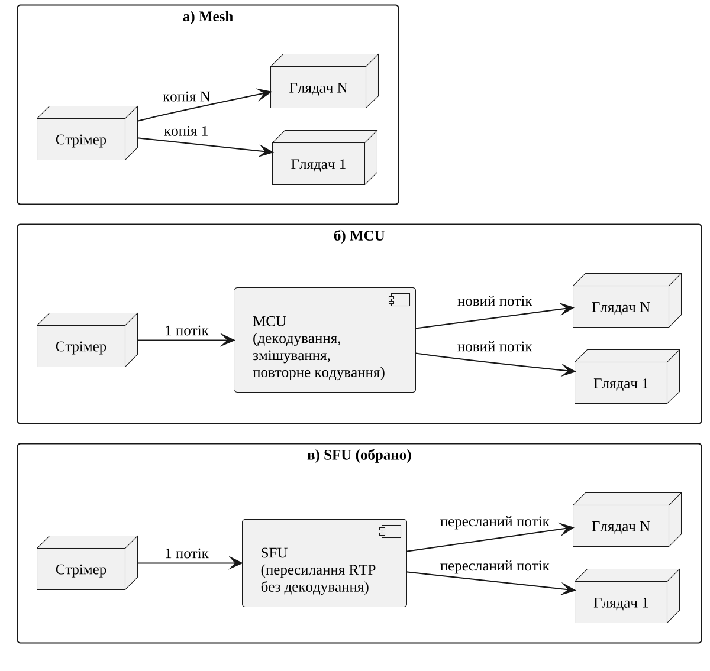

# 1 Аналіз предметної області та специфікація вимог

## 1.1 Аналіз предметної області

**1.1.1 Потокова передача медіаконтенту.** Потокова передача передбачає доставлення аудіо- та відеоданих отримувачу в міру їх надходження, коли відтворення починається до завершення передавання. Розрізняють передачу за запитом, за якої матеріал існує заздалегідь, і пряму трансляцію, за якої контент формується в момент передавання. Для прямої трансляції визначальною є затримка доставки — проміжок часу між подією на стороні джерела та її відтворенням у глядача, від якого залежить можливість взаємодії в реальному часі. Затримка визначається насамперед технологією доставки (табл. @tbl:delivery).

Протокол HTTP Live Streaming (HLS) передає необмежений потік мультимедійних даних через HTTP у вигляді списку відтворення з послідовних медіасегментів [@rfc8216]. Специфікація вимагає, щоб точка початку відтворення живого списку не була ближчою до його кінця, ніж три цільові тривалості сегмента [@rfc8216], а настанови Apple рекомендують цільову тривалість 6 с [@apple-hls-authoring]. Отже, затримка, закладена самою моделлю доставки, вимірюється секундами. Розширення Low-Latency HLS за рахунок часткових сегментів близько 200 мс знижує її до рівня телевізійного мовлення [@apple-ll-hls], а YouTube у режимах низької та наднизької затримки обіцяє більшості глядачів запізнення менше 10 с і менше 5 с відповідно [@youtube-latency].

Протокол RTMP, запроваджений 2002 року, передає потоки поверх TCP і нині слугує переважно для приймання (ingest) потоку від кодувальника платформою [@enhanced-rtmp]; саме так Twitch приймає трансляції з OBS Studio [@twitch-video-broadcast]. Технологія WebRTC, натомість, призначена для двобічного обміну медіаданими в реальному часі безпосередньо з браузера [@w3c-webrtc].

: Технології доставки медіапотоків {#tbl:delivery}

| Технологія | Транспорт | Роль у ланцюгу трансляції | Затримка (за джерелами) |
|---|---|---|---|
| RTMP | TCP | приймання потоку від кодувальника платформою [@enhanced-rtmp; @twitch-video-broadcast] | не нормується, залежить від подальшої доставки |
| HLS | HTTP, сегменти | доставка глядачам через HTTP-інфраструктуру [@rfc8216] | секунди: старт не ближче трьох цільових тривалостей (рекомендовано 6 с) від кінця списку [@rfc8216; @apple-hls-authoring] |
| Low-Latency HLS | HTTP, часткові сегменти | доставка глядачам зі зниженою затримкою [@apple-ll-hls] | на рівні телевізійного мовлення [@apple-ll-hls] |
| WebRTC | UDP (RTP/SRTP), ICE | двобічна передача між браузерами та серверами [@w3c-webrtc; @rfc8825] | реальний час; у топології SFU — «надзвичайно низька» [@rfc7667] |

З табл. @tbl:delivery видно, що технології на основі HTTP оптимізовано для масштабованої доставки ціною затримки в секунди, тоді як WebRTC розрахована на інтерактивну взаємодію. Оскільки глядач спостерігає за роботою застосунку стрімера і реагує на неї, у роботі як транспорт обрано WebRTC.

**1.1.2 Стек технологій WebRTC.** WebRTC поєднує програмний інтерфейс браузера, стандартизований W3C [@w3c-webrtc], і набір протоколів IETF, огляд яких наведено в RFC 8825 [@rfc8825]. Медіадані передаються у форматі RTP [@rfc3550], причому реалізація захищеного профілю SRTP є обов'язковою [@rfc8825]. Архітектура безпеки WebRTC забороняє передавання медіа через незашифрований RTP і вимагає пропонувати для кожного медіаканалу узгодження ключів DTLS-SRTP [@rfc8827]. Встановлення з'єднання крізь трансляцію мережевих адрес (NAT) забезпечує протокол ICE, який перевіряє пари кандидатних адрес учасників [@rfc8445]. Опис сеансу узгоджується за моделлю «пропозиція/відповідь» протоколу JSEP, який навмисно не визначає сигнальний протокол і залишає спосіб обміну описами застосунку [@rfc9429].

Тому в stream-share сигналізацію реалізовано власним протоколом повідомлень поверх WebSocket (типи повідомлень — у пакеті `packages/shared`), а медіасервер оголошує в ICE-кандидатах публічну адресу зі змінної `MEDIASOUP_ANNOUNCED_IP`; протокол розглянуто в розділі 3.

**1.1.3 Топології багатосторонньої передачі.** Передавання від одного стрімера кільком глядачам можливе в трьох основних топологіях RFC 7667 [@rfc7667] (рис. @fig:topologies). У топології mesh відправник надсилає окрему копію потоку кожному отримувачу, тож вихідний канал стрімера зростає пропорційно кількості глядачів. Мікшер (MCU) декодує, змішує та повторно кодує потоки, що потребує значних обчислювальних ресурсів і погіршує якість [@rfc7667]. Вузол селективного пересилання (SFU) лише пересилає RTP-потоки без обробки сигналу, тому має надзвичайно низьку затримку і масштабується на велику кількість користувачів [@rfc7667].

{#fig:topologies width=15cm}

На рис. @fig:topologies показано, що в топології SFU стрімер відправляє рівно один потік незалежно від кількості глядачів, а сервер розмножує його без декодування. Відеоконференції та трансляції є двома найпоширенішими сценаріями застосування SFU [@andre2018]. Бібліотека mediasoup реалізує SFU як модуль Node.js і не нав'язує сигнальний протокол [@mediasoup-overview]; у stream-share вона працює на сигнальному сервері (`apps/signaling/src/services/mediasoup.service.ts`), а її вибір обґрунтовано в підрозділі 4.1.

**1.1.4 Захоплення екрана, вікна та окремого застосунку.** У браузері захоплення вмісту дисплея виконує метод `getDisplayMedia()` специфікації Screen Capture, яка визначає три типи поверхонь: монітор, вікно окремого застосунку та вкладку браузера [@w3c-screen-capture]. Специфікація вимагає, щоб користувач щоразу сам обирав поверхню з усіх доступних, і забороняє застосунку обмежувати цей вибір; джерела захоплення не перелічуються сторінці, оскільки це розкрило б забагато інформації про систему [@w3c-screen-capture]. Виклик можливий лише у відповідь на дію користувача, а дозвіл не зберігається [@mdn-getdisplaymedia]. Звук необов'язковий: браузер може не повернути аудіодоріжку, а параметри `systemAudio` і `windowAudio` є лише підказками [@w3c-screen-capture; @mdn-getdisplaymedia]. Chrome пропонує звук вкладки, а системний звук, за поясненням розробників Chrome, містить і сторонні джерела, зокрема голоси учасників відеоконференції [@chrome-screen-sharing-controls].

Отже, вебсторінка не може програмно обрати потрібне вікно, гарантовано отримати звук лише цього застосунку чи самостійно перейти до його нового, наприклад дочірнього, вікна, адже кожна нова поверхня потребує нового вибору користувачем.

Ці обмеження долаються в настільному застосунку. Модуль `desktopCapturer` платформи Electron перелічує джерела типів «екран» і «вікно», а обробник `setDisplayMediaRequestHandler` дозволяє самостійно відповісти на запит `getDisplayMedia()` обраним джерелом [@electron-desktop-capturer]. Його аудіорежим `loopback` захоплює лише весь системний звук і підтримується тільки у Windows [@electron-session]. Звук окремого процесу дають системні інтерфейси WASAPI Process Loopback (Windows 10 2004+), ScreenCaptureKit (macOS 13+) і PipeWire (Linux), які об'єднує нативний модуль `electron-native-screenshare`; він також визначає ідентифікатор процесу за дескриптором вікна [@electron-native-screenshare].

Настільний застосунок stream-share використовує саме цей підхід (`apps/desktop/src/conveyor/handlers/stream.handler.ts`): обране через `desktopCapturer` вікно передається вебсторінці через обробник запиту захоплення, а звук процесу-власника вікна захоплюється в окремому службовому процесі; якщо процес визначити не вдається, захоплюється системний звук без звуку самого захоплювача. Компонент `SourceFollower` кожні 1 500 мс перевіряє появу нових вікон тієї самої родини процесів, перемикає на них джерело і повертається до початкового вікна після їх закриття. Реалізацію розглянуто в підрозділі 4.2.

**1.1.5 Учасники предметної області.** Стрімер — автентифікований користувач, який створює трансляцію, обирає джерело і керує її параметрами; приватна трансляція не з'являється в загальному переліку, але доступна за посиланням. Глядач переглядає трансляцію у браузері, а гість — це глядач без облікового запису, для якого сторінка перегляду автоматично створює анонімний сеанс. Зовнішнім учасником є постачальник ідентичності Google. Варіанти використання для цих ролей наведено в підрозділі 1.3.

## 1.2 Аналіз наявних програмних рішень

Для порівняння обрано рішення різних класів, що дозволяють показати іншим вміст екрана: Twitch разом із кодувальником OBS Studio, YouTube Live, Discord Go Live, Google Meet, Zoom і засіб віддаленого доступу Parsec. Аналіз ґрунтується лише на офіційній документації; не описані в ній характеристики позначено «не зазначено» (табл. @tbl:analogs).

**1.2.1 Платформи трансляцій.** OBS Studio — вільна програма для запису та прямих трансляцій для Windows, macOS і Linux [@obs-home]. Джерело «Window Capture» захоплює вміст конкретного вікна навіть тоді, коли воно перекрите іншими, а параметр «Window Match Priority» визначає, як шукати вікно, якщо попереднє не знайдено: за збігом заголовка або вікно того самого типу [@obs-window-capture]. Починаючи з версії 28, OBS Studio може захоплювати звук окремих застосунків, але лише у Windows 10 версії 2004 і новіших та Windows 11 [@obs-app-audio]. Сформований потік передається на Twitch через RTMP [@twitch-video-broadcast]. YouTube Live підтримує трансляції з вебкамери, мобільного пристрою, ігрової консолі та через програмний кодувальник; останній варіант призначено, зокрема, для трансляції ігрового процесу [@youtube-get-started]. Отже, трансляція окремого застосунку на YouTube також потребує стороннього кодувальника, а канал має бути верифікованим [@youtube-get-started]; відео з доступом за посиланням можна переглядати без облікового запису Google [@youtube-privacy].

**1.2.2 Месенджери та сервіси відеоконференцій.** Discord Go Live дозволяє транслювати окреме вікно застосунку або весь екран у голосовому каналі сервера чи у виклику. Звук застосунку захоплюється лише в настільних клієнтах для Windows і macOS, у браузері Chrome та в мобільних клієнтах, а в Linux недоступний. Без підписки Nitro якість обмежено 720p/30 кадрів за секунду, а кількість глядачів однієї трансляції — 50; щоб переглянути трансляцію, глядач має приєднатися до голосового каналу [@discord-go-live]. Google Meet дозволяє показати вкладку, окреме вікно або весь екран; звук передається або разом із вкладкою Chrome, або як системний звук під час показу вікна чи екрана [@meet-present]. Zoom також дозволяє показати весь екран чи окремі вікна застосунків, проте функція спільного доступу до звуку передає весь звук, який відтворює комп'ютер; у вебверсії доступний звук вкладки лише в Chrome, а в сеансах Linux на Wayland можна показати тільки весь робочий стіл [@zoom-share-screen].

**1.2.3 Засоби віддаленого доступу.** Parsec — пропрієтарний застосунок для ігор і віддаленої роботи з власним протоколом BUD поверх UDP, який, за вимірюваннями розробника, додає в локальній мережі лише 7 мс затримки [@parsec-overview]. Хост надає доступ до всього екрана і підтверджує підключення запрошених користувачів [@parsec-hosting]; хостом може бути лише комп'ютер з Windows або macOS [@parsec-compat]. Вебклієнт працює тільки в Chrome чи Chromium і поступається настільному за продуктивністю [@parsec-web].

: Порівняння наявних програмних рішень {#tbl:analogs}

| Критерій | Twitch + OBS Studio | YouTube Live | Discord Go Live | Google Meet | Zoom | Parsec |
|---|---|---|---|---|---|---|
| Клас рішення | платформа трансляцій + кодувальник | платформа трансляцій | месенджер | відеоконференції | відеоконференції | віддалений доступ |
| Захоплення окремого вікна | так [@obs-window-capture] | через сторонній кодувальник [@youtube-get-started] | так [@discord-go-live] | так [@meet-present] | так [@zoom-share-screen] | ні, весь екран [@parsec-hosting] |
| Звук лише обраного застосунку | так, лише Windows 10 2004+ [@obs-app-audio] | через сторонній кодувальник | так, крім Linux [@discord-go-live] | ні: вкладка або системний звук [@meet-present] | ні: весь звук комп'ютера [@zoom-share-screen] | не зазначено |
| Перехід до нових вікон застосунку | частково: пошук вікна за заголовком чи типом [@obs-window-capture] | не зазначено | не зазначено | не зазначено | не зазначено | не застосовно |
| Умови перегляду | [ПОТРЕБУЄ УТОЧНЕННЯ: умови перегляду за офіційною довідкою Twitch] | за посиланням без облікового запису Google [@youtube-privacy] | приєднання до голосового каналу або виклику [@discord-go-live] | участь у зустрічі [@meet-present] | участь у зустрічі [@zoom-share-screen] | підключення з підтвердженням хоста [@parsec-hosting] |
| Задокументовані обмеження | не зазначено | без 4K у режимах низької затримки [@youtube-latency] | 50 глядачів; 720p/30 без Nitro [@discord-go-live] | до 10 одночасних показів [@meet-present] | не зазначено | хост лише Windows і macOS [@parsec-compat] |
| Затримка за даними розробника | не зазначено | < 10 с або < 5 с [@youtube-latency] | не зазначено | не зазначено | не зазначено | +7 мс у локальній мережі [@parsec-overview] |

Табл. @tbl:analogs показує, що жодне з рішень не поєднує всіх властивостей, потрібних для трансляції окремого застосунку. Платформи трансляцій покладають захоплення на сторонній кодувальник, у якому звук окремого застосунку доступний лише у Windows, а затримка доставки YouTube вимірюється секундами. Discord, Google Meet і Zoom прив'язують глядача до голосового каналу або зустрічі, і звук окремого застосунку з них передає лише Discord, причому не в Linux. Parsec розрахований на віддалене керування цілим комп'ютером. Автоматичний перехід до нових вікон застосунку не описано в жодній документації; найближчим є повторний пошук вікна в OBS Studio.

Отже, нішу розроблюваного вебсервісу визначає поєднання захоплення окремого застосунку з його власним звуком, слідування за дочірніми вікнами цього застосунку, доставки з низькою затримкою через WebRTC і SFU та перегляду у браузері без встановлення програм, зокрема гостем без облікового запису. Ці властивості покладено в основу функціональних вимог підрозділу 1.3.
