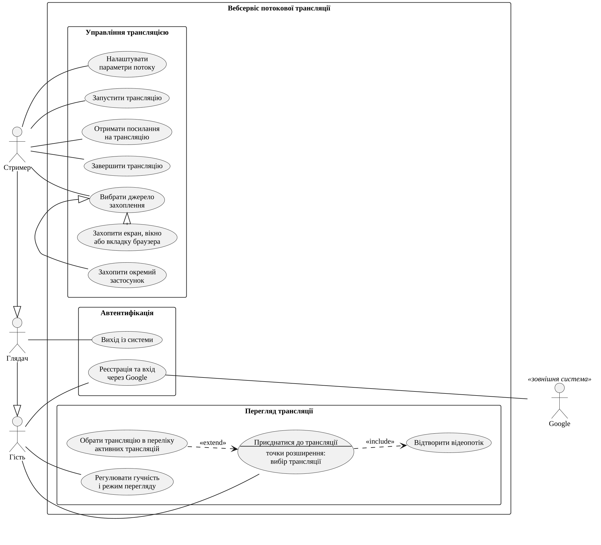

## 1.3 Функціональні вимоги до програмної системи

Функціональні вимоги до вебсервісу сформульовано за результатами аналізу предметної області та наявних рішень і зафіксовано у вигляді моделі варіантів використання мови UML [@omg-uml]. [ПОТРЕБУЄ УТОЧНЕННЯ: звірити перелік вимог із формулюваннями індивідуального завдання на кваліфікаційну роботу]

Система взаємодіє з двома категоріями людей і однією зовнішньою системою.

Глядач – відвідувач, який переглядає трансляції: незареєстрований глядач лише відкриває трансляцію за посиланням в автоматично створеному гостьовому сеансі, а глядач, що зареєструвався через Google, додатково обирає трансляції з переліку активних публічних трансляцій.

Стример – зареєстрований користувач, який розпочинає та завершує трансляції у браузері або в настільному застосунку й водночас має всі можливості глядача.

Google – зовнішня система, що підтверджує особу глядача під час авторизації за протоколом OAuth 2.0.

Проаналізувавши можливості дійових осіб, складено діаграму варіантів використання, яку наведено на рис. @fig:use-cases.

{#fig:use-cases width=13cm}

Діаграма містить шість варіантів використання. Глядачу доступні «Перегляд трансляції» та «Авторизація через Google», у якій бере участь зовнішня система Google. Стример успадковує ці можливості, оскільки узагальнює глядача, і додатково виконує «Трансляцію у браузері», «Трансляцію окремого застосунку» та «Завершення трансляції». Отже, незареєстрований глядач може лише переглядати доступні трансляції, а для показу екрана чи застосунку потрібна реєстрація. «Трансляція у браузері» використовує стандартне захоплення екрана, вікна чи вкладки, а «Трансляція окремого застосунку» доступна лише в настільному застосунку, де система захоплює звук обраного застосунку й переходить до його нових вікон. «Реєстрація» розширює авторизацію (відношення «extend») у точці розширення «перший вхід»: окремої форми реєстрації система не має, а запис користувача створюється лише тоді, коли підтверджений Google обліковий запис ще не пов'язаний із жодним користувачем. Наступні входи завершуються без реєстрації, тому вона є умовним доповненням авторизації, а не обов'язковим включенням «include». Вхід не включено й до варіантів стримера, бо система вимагає його лише за відсутності чинного сеансу, тобто він є передумовою, а не кроком цих варіантів.

Узагальнений перелік функціональних вимог наведено в табл. @tbl:requirements. Кожну вимогу позначено кодом, за яким її простежено під час проєктування, реалізації та тестування, і частиною системи, що її реалізує.

: Функціональні вимоги до програмної системи {#tbl:requirements}

| Код | Вимога | Частина системи |
|---|---|---|
| ФВ-01 | Вхід через обліковий запис Google з вибором облікового запису під час кожного входу; вихід із системи | вебзастосунок |
| ФВ-02 | Вхід у настільному застосунку через системний браузер із передаванням сеансу в застосунок за схемою PKCE | настільний застосунок, вебзастосунок |
| ФВ-03 | Автоматичне створення гостьового сеансу з випадковим іменем та згенерованим аватаром під час відкриття сторінки перегляду; повторне використання гостьового запису в тому самому браузері | вебзастосунок |
| ФВ-04 | Обмеження доступу: сторінки, крім головної, сторінки входу та сторінки перегляду, доступні лише користувачам, які увійшли через Google | вебзастосунок |
| ФВ-05 | Перелік активних публічних трансляцій із мініатюрами та посторінковим переглядом по 12 елементів | вебзастосунок, сервер сигналізації |
| ФВ-06 | Трансляція у браузері з вибором екрана, вікна чи вкладки та звуку стандартними засобами браузера | вебзастосунок |
| ФВ-07 | Перелік екранів і вікон із мініатюрами та піктограмами застосунків у настільному застосунку | настільний застосунок |
| ФВ-08 | Захоплення звуку обраного застосунку; за неможливості захоплення – трансляція лише відео з повідомленням користувачу | настільний застосунок |
| ФВ-09 | Режим слідування: автоматичне перемикання трансляції на нові вікна того самого застосунку та повернення до початкового вікна | настільний застосунок, вебзастосунок |
| ФВ-10 | Вибір якості (360p, 480p, 720p, 1080p, 1440p, вихідна) і частоти кадрів (5, 30, 60 кадр/с) до початку та під час трансляції | вебзастосунок |
| ФВ-11 | Позначення трансляції як приватної: вона не потрапляє до переліку, але доступна за посиланням | вебзастосунок, сервер сигналізації |
| ФВ-12 | Формування та копіювання посилання на перегляд активної трансляції | вебзастосунок |
| ФВ-13 | Вимкнення та ввімкнення звуку трансляції без її зупинення | вебзастосунок |
| ФВ-14 | Перегляд трансляції з керуванням гучністю, режимом «картинка в картинці» та повноекранним режимом | вебзастосунок, сервер сигналізації |
| ФВ-15 | Завершення трансляції стримером зі сповіщенням глядачів | вебзастосунок, сервер сигналізації |
| ФВ-16 | Збереження трансляції під час втрати з'єднання стримера (до 5 спроб з інтервалом 6 с) і відновлення її з того самого або іншого вікна браузера | сервер сигналізації, вебзастосунок |
| ФВ-17 | Періодичне оновлення мініатюри трансляції (кожні 5 хв); завантаження мініатюри дозволено лише власнику трансляції | вебзастосунок, сервер сигналізації |
| ФВ-18 | Завантаження настільного застосунку для операційної системи відвідувача; перевірка й установлення оновлень для Windows і Linux | вебзастосунок, настільний застосунок |
| ФВ-19 | Щотижневе видалення неактивних гостьових записів, не пов'язаних із жодною трансляцією | сервер сигналізації |

Вимоги ФВ-01–ФВ-05 визначають доступ до системи, ФВ-06–ФВ-13 – підготовку й ведення трансляції, ФВ-14–ФВ-17 – доставлення потоку глядачам і життєвий цикл трансляції, ФВ-18 і ФВ-19 є службовими. Вимоги ФВ-07–ФВ-09 реалізують захоплення окремих застосунків і доступні лише в настільному застосунку, оскільки вебсторінка не може ні обрати звук окремого процесу, ні відстежувати появу його вікон.

Для кожного з наведених варіантів використання складемо сценарій [@cockburn-use-cases] (сценарії @sc:sign-in – @sc:end-reconnect). Назви кнопок у сценаріях наведено так, як їх показує інтерфейс системи.

::: {#sc:sign-in caption="Авторизація через Google"}
**Основна дійова особа:** глядач.

**Результат:** глядач увійшов до системи як зареєстрований користувач і отримав сеанс.

**Тригер:** глядач відкриває сторінку входу або сторінку, доступну лише після входу.

**Основний успішний сценарій:**

1. Глядач переходить до сторінки входу.
2. Система відображає кнопку «Continue with Google».
3. Глядач натискає кнопку «Continue with Google».
4. Система перенаправляє глядача до сервісу автентифікації Google із запитом на вибір облікового запису.
5. Глядач обирає обліковий запис Google і підтверджує вхід.
6. Система знаходить запис користувача, пов'язаний з обраним обліковим записом Google.
7. Система встановлює сеансовий файл cookie та перенаправляє глядача на головну сторінку з переліком активних трансляцій.

**Альтернативні сценарії:**

3а. Вхід розпочато в настільному застосунку.

3а.1. Система відкриває сторінку автентифікації в системному браузері, де виконуються кроки 4–6.

3а.2. Система передає настільному застосунку одноразовий код через локальну адресу 127.0.0.1.

3а.3. Настільний застосунок обмінює код на сеанс. Перехід до п. 7.

3б. Глядач скасовує вхід у настільному застосунку або не завершує його протягом 5 хв.

3б.1. Система припиняє очікування, сеанс не створюється. Повернення до п. 3.

5а. Сервіс автентифікації Google відхиляє вхід.

5а.1. Система повертає глядача на сторінку входу. Повернення до п. 3.

6а. Обліковий запис Google ще не пов'язаний із жодним користувачем (точка розширення «перший вхід»).

6а.1. Варіант використання «Реєстрація». Перехід до п. 7.
:::

::: {#sc:sign-up caption="Реєстрація"}
**Основна дійова особа:** незареєстрований глядач.

**Результат:** створено запис користувача, пов'язаний з обліковим записом Google.

**Тригер:** підтверджений Google обліковий запис не пов'язаний із жодним користувачем.

**Основний успішний сценарій:**

1. Система отримує від Google ім'я, адресу електронної пошти та зображення профілю глядача.
2. Система перевіряє, що користувача з такою адресою електронної пошти не існує.
3. Система створює запис користувача з роллю зареєстрованого користувача.
4. Система зберігає зв'язок запису користувача з обліковим записом Google і повертається до п. 7 сценарію @sc:sign-in.

**Альтернативні сценарії:**

2а. Користувач із такою адресою електронної пошти вже існує, але не пов'язаний із цим обліковим записом Google.

2а.1. Система відмовляє у вході та повертає глядача на сторінку входу.
:::

::: {#sc:watch caption="Перегляд трансляції"}
**Основна дійова особа:** глядач.

**Результат:** глядач бачить і чує трансляцію в реальному часі.

**Тригер:** глядач відкриває посилання на трансляцію або обирає її в переліку активних трансляцій.

**Основний успішний сценарій:**

1. Глядач переходить за посиланням на сторінку перегляду трансляції.
2. Система перевіряє, що трансляція існує та не завершена.
3. Система створює гостьовий сеанс, якщо глядач не увійшов до системи, або відновлює створений раніше в цьому браузері.
4. Система реєструє глядача, з'єднується із сервером сигналізації та отримує відео- та аудіопотоки.
5. Система відтворює трансляцію.
6. Глядач керує гучністю, режимом «картинка в картинці» та повноекранним режимом.

**Альтернативні сценарії:**

1а. Зареєстрований глядач відкриває головну сторінку.

1а.1. Система показує перелік активних публічних трансляцій із мініатюрами.

1а.2. Глядач обирає трансляцію. Перехід до п. 2.

2а. Трансляцію не знайдено або її завершено.

2а.1. Система показує відповідне повідомлення.

5а. Браузер заблокував автоматичне відтворення.

5а.1. Система показує кнопку запуску відтворення.

5а.2. Глядач натискає кнопку, і система відтворює трансляцію.

5б. Стример втратив з'єднання із сервером.

5б.1. Система залишає сторінку перегляду відкритою та очікує відновлення трансляції.

5б.2. Після відновлення трансляції система автоматично отримує новий потік. Повернення до п. 5.
:::

::: {#sc:browser-broadcast caption="Трансляція у браузері"}
**Основна дійова особа:** стример.

**Результат:** трансляція має статус «наживо», а глядачі можуть переглядати її за посиланням.

**Тригер:** стример відкриває сторінку трансляції.

**Основний успішний сценарій:**

1. Стример переходить до сторінки трансляції.
2. Система відображає перемикачі якості, частоти кадрів і приватного режиму та кнопку «Pick source».
3. Стример обирає якість і частоту кадрів, за потреби вмикає приватний режим і натискає кнопку «Pick source».
4. Система відображає стандартне вікно браузера для вибору екрана, вікна або вкладки.
5. Стример обирає джерело захоплення.
6. Система показує попередній перегляд джерела.
7. Стример натискає кнопку «Start stream».
8. Система створює трансляцію, з'єднується із сервером сигналізації та передає відео- та аудіопотоки.
9. Система встановлює трансляції статус «наживо» та відображає посилання на перегляд.

**Альтернативні сценарії:**

5а. Стример закриває вікно вибору, не обравши джерело.

5а.1. Система не розпочинає трансляцію. Повернення до п. 3.

9а. Стример змінює якість або частоту кадрів під час трансляції.

9а.1. Система застосовує нові параметри кодування без перезапуску трансляції.

9б. Стример припиняє показ засобами браузера.

9б.1. Система завершує трансляцію.
:::

::: {#sc:app-broadcast caption="Трансляція окремого застосунку"}
**Основна дійова особа:** стример.

**Результат:** глядачі отримують зображення та звук лише обраного застосунку, зокрема з його нових вікон.

**Тригер:** стример відкриває сторінку трансляції в настільному застосунку.

**Основний успішний сценарій:**

1. Стример натискає кнопку «Pick source».
2. Система відображає перелік екранів і вікон застосунків із мініатюрами та піктограмами.
3. Стример обирає вікно застосунку та за потреби вмикає перемикач «Follow app».
4. Система запускає захоплення звуку процесу, якому належить вікно, і показує попередній перегляд.
5. Стример обирає якість і частоту кадрів та натискає кнопку «Start stream».
6. Система розпочинає трансляцію, як у кроках 8–9 сценарію @sc:browser-broadcast.
7. Стример відкриває в застосунку, що транслюється, нове вікно.
8. Система перемикає трансляцію на нове вікно та показує його назву.
9. Стример закриває нове вікно.
10. Система повертає трансляцію до початкового вікна.

**Альтернативні сценарії:**

3а. Стример обирає екран.

3а.1. Система робить перемикач «Follow app» недоступним, і трансляція відбувається без слідування за вікнами.

4а. Захопити звук застосунку не вдалося.

4а.1. Система повідомляє, що звук недоступний, і транслює лише відео.

8а. Режим слідування вимкнено.

8а.1. Система продовжує транслювати початкове вікно.

10а. Початкове вікно застосунку закрито, і воно не з'являється знову протягом 20 с.

10а.1. Система повідомляє про закриття застосунку та завершує трансляцію.
:::

::: {#sc:end-reconnect caption="Завершення трансляції"}
**Основна дійова особа:** стример.

**Результат:** трансляцію завершено, а її глядачів сповіщено.

**Тригер:** стример вирішує завершити трансляцію, що має статус «наживо».

**Основний успішний сценарій:**

1. Стример натискає кнопку «Stop stream».
2. Система встановлює трансляції статус «завершено» з причиною «зупинено стримером».
3. Система звільняє ресурси сервера, виділені трансляції.
4. Система надсилає глядачам подію завершення трансляції.
5. Система показує глядачам повідомлення про завершення трансляції.

**Альтернативні сценарії:**

1а. З'єднання стримера із сервером розірвано до натискання кнопки.

1а.1. Система сповіщає глядачів про втрату з'єднання стримера та очікує повторного підключення до 5 спроб з інтервалом 6 с.

1а.2. Стример відкриває сторінку трансляції, на якій система показує повідомлення «You have an unfinished stream», і натискає кнопку «Reconnect».

1а.3. Система відновлює передавання потоку тим самим глядачам.

1б. Стример не підключився протягом очікування.

1б.1. Система встановлює трансляції статус «завершено» з причиною «тайм-аут». Перехід до п. 3.

1в. Сервер сигналізації перезапущено.

1в.1. Під час запуску система встановлює всім незавершеним трансляціям статус «завершено».
:::

Кроки 3, 4 і 8 сценарію @sc:app-broadcast відрізняють систему від аналогів (табл. @tbl:analogs). Сценарії є основою для оцінювання трудомісткості та розроблення тестових прикладів.

## 1.4 Нефункціональні вимоги

Нефункціональні вимоги згруповано за моделлю якості ISO/IEC 25010 [@iso25010], а їхні числові значення взято з коду та конфігурації системи.

Вимоги до надійності:

1\) після розриву з'єднання стримера система повинна очікувати його повторного підключення протягом 5 спроб з інтервалом 6 с і лише потім завершувати трансляцію;

2\) під час запуску сервер сигналізації повинен завершувати трансляції, що залишилися незавершеними після його зупинки;

3\) якщо звук застосунку захопити не вдалося, система повинна транслювати лише відео й повідомляти про це стримера.

Вимоги до продуктивності:

1\) система повинна без дій стримера перемикати трансляцію на нове вікно застосунку протягом одного циклу опитування вікон (1,5 с), а після його закриття – повертати до початкового вікна;

2\) система повинна передавати зображення в профілях від 360p до роздільності джерела (до 3840×2160) з частотою 5, 30 або 60 кадр/с, понад 1440p – до 30 кадр/с;

3\) бітрейт відео повинен становити від 300 кбіт/с до 18 Мбіт/с залежно від профілю, початковий вихідний бітрейт сервера – не менше 4 Мбіт/с, вхідний – до 21,6 Мбіт/с;

4\) сервер повинен запускати стільки процесів пересилання медіапотоків, скільки ядер має процесор, і призначати трансляцію найменш завантаженому з них;

5\) затримка доставки зображення глядачеві не повинна перевищувати [ПОТРЕБУЄ УТОЧНЕННЯ: цільове значення затримки].

Вимоги до безпеки:

1\) закриті сторінки та маршрути WebSocket повинні бути недоступні без дійсного сеансу, а керувати трансляцією повинен мати змогу лише її власник – зареєстрований стример;

2\) сеанс повинен зберігатися як JWT у cookie з атрибутами HttpOnly і SameSite=Lax, у виробничому середовищі – також Secure і префіксом \_\_Secure-, і перевірятися сервером WebSocket;

3\) вхід із настільного застосунку повинен виконуватися в системному браузері за схемою PKCE з перевіркою параметра state [@rfc8252; @rfc7636], бо Google блокує вхід у вбудованих вебпереглядах [@google-embedded-webviews]; запит дійсний 15 хв, одноразовий код – 120 с;

4\) сторінки настільного застосунку повинні працювати з ізоляцією контексту, без доступу до Node.js, а дані каналів IPC – перевірятися схемами.

Вимоги до сумісності:

1\) перегляд трансляції повинен працювати в браузері без встановлення додаткових програм;

2\) звук повинен передаватися кодеком Opus, а відео – насамперед кодеком H.264, що дає змогу апаратного кодування, з резервним кодеком VP8;

3\) настільний застосунок повинен постачатися для Windows, macOS і Linux з автоматичним оновленням у Windows і Linux та ручним – у macOS [ПОТРЕБУЄ УТОЧНЕННЯ: чи випробувано застосунок на macOS].

Вимоги до супроводжуваності:

1\) змінні середовища кожного застосунку повинні перевірятися схемами під час запуску, а помилка конфігурації – зупиняти запуск;

2\) протокол обміну повідомленнями, схеми даних і розрахунок бітрейту повинні бути спільними модулями вебзастосунку й сервера сигналізації;

3\) код повинен писатися мовою TypeScript із суворою перевіркою типів.

Вимоги до зручності використання:

1\) англомовний інтерфейс повинен мати світлу й темну теми відповідно до налаштувань операційної системи;

2\) перед трансляцією система повинна показувати мініатюри вікон і екранів та попередній перегляд обраного джерела.

## Висновки до розділу 1

Аналіз предметної області обґрунтував вибір WebRTC у топології SFU для трансляцій з одним джерелом і багатьма глядачами, а порівняння з аналогами – відсутність рішення, що поєднує захоплення окремого застосунку з його звуком, перехід до його нових вікон і перегляд у браузері без приєднання до зустрічі.

На цій основі визначено дійових осіб «Глядач» і «Стример», шість варіантів використання зі сценаріями, 19 функціональних вимог і нефункціональні вимоги до надійності, продуктивності, безпеки, сумісності, супроводжуваності та зручності використання.
