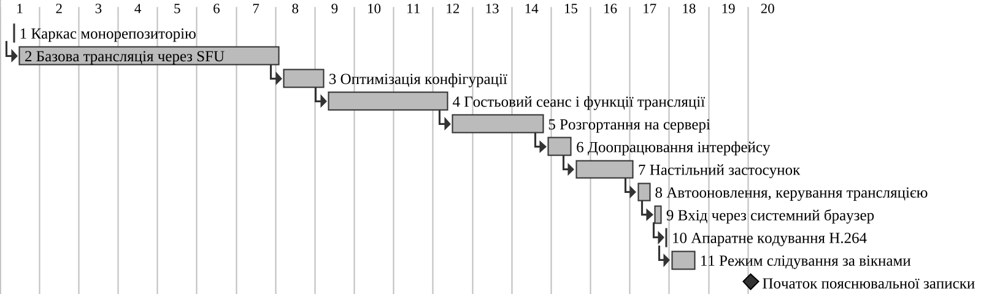

# 2 Планування програмного проєкту

## 2.1 Оцінювання тривалості розробки

Для оцінювання трудомісткості обрано метод точок варіантів використання (Use Case Points, UCP), запропонований Г. Карнером у 1993 р. [@azzeh-nassif-ucp]. Вихідними даними методу є модель варіантів використання з підрозділу 1.3 (рис. @fig:use-cases, сценарії @sc:sign-in–@sc:end-reconnect). Вагові коефіцієнти та формули взято з опису методу [@azzeh-nassif-ucp]; значення впливу факторів є експертними судженнями автора, обґрунтованими нижче.

**2.1.1 Вагові коефіцієнти дійових осіб.** Дійових осіб (табл. @tbl:ucp-actors) поділяють на прості (зовнішня система з програмним інтерфейсом), середні (система, що взаємодіє через протокол, наприклад HTTP, або сховище даних) і складні (людина, що працює через графічний або вебінтерфейс). Нескоригована вага дійових осіб обчислюється за формулою @eq:uaw:

::: {#eq:uaw}
$$UAW = 1 \cdot a_s + 2 \cdot a_a + 3 \cdot a_c,$$
:::

де $a_s$, $a_a$, $a_c$ – кількість простих, середніх і складних дійових осіб відповідно.

: Класифікація дійових осіб {#tbl:ucp-actors}

| Дійова особа | Спосіб взаємодії із системою | Тип | Вага |
|---|---|---|---|
| Гість | вебінтерфейс у браузері | складний | 3 |
| Користувач (стрімер / глядач) | вебінтерфейс і настільний застосунок | складний | 3 |
| Google (OAuth 2.0) | протокол OAuth 2.0 поверх HTTPS | середній | 2 |

Отже, $UAW = 2 \cdot 3 + 1 \cdot 2 = 8$.

**2.1.2 Вагові коефіцієнти варіантів використання.** Складність варіанта використання визначають кількістю транзакцій – пар «дія дійової особи – відповідь системи» в основному й альтернативних сценаріях: до трьох транзакцій – простий (вага 5), від чотирьох до семи – середній (10), понад сім – складний (15). Нескоригована вага варіантів використання обчислюється за формулою @eq:uucw:

::: {#eq:uucw}
$$UUCW = 5 \cdot u_s + 10 \cdot u_a + 15 \cdot u_c,$$
:::

де $u_s$, $u_a$, $u_c$ – кількість простих, середніх і складних варіантів використання.

Для п'яти деталізованих варіантів використання транзакції підраховано за кроками сценаріїв підрозділу 1.3. Варіанти, що включаються в основні або розширюють їх (вибір вікна, звук застосунку, слідування, якість, приватність, гостьовий сеанс), окремо не враховано, бо їхні кроки вже містяться в сценаріях. Решту варіантів оцінено за вимогами табл. @tbl:requirements. Результат наведено в табл. @tbl:ucp-use-cases.

: Класифікація варіантів використання {#tbl:ucp-use-cases}

| Варіант використання | Транзакцій | Тип | Вага |
|---|---|---|---|
| Увійти через Google (у т. ч. з настільного застосунку) | 5 + 3 = 8 | складний | 15 |
| Розпочати трансляцію у браузері | 6 + 3 = 9 | складний | 15 |
| Розпочати трансляцію окремого застосунку | 5 + 3 = 8 | складний | 15 |
| Переглянути трансляцію | 4 + 3 = 7 | середній | 10 |
| Завершити або відновити трансляцію | 3 + 4 = 7 | середній | 10 |
| Переглянути перелік активних трансляцій | 3 | простий | 5 |
| Керувати активною трансляцією (звук, посилання) | 2 | простий | 5 |
| Завантажити та оновити настільний застосунок | 2 | простий | 5 |
| Вийти з облікового запису | 2 | простий | 5 |
| Разом | – | – | 85 |

Нескориговані точки варіантів використання становлять $UUCP = UAW + UUCW = 8 + 85 = 93$.

**2.1.3 Технічна складність.** Технічний коефіцієнт враховує 13 факторів (табл. @tbl:ucp-tcf), вплив кожного з яких оцінюють від 0 (відсутній) до 5 (суттєвий) і множать на вагу фактора. Коефіцієнт обчислюється за формулою @eq:tcf:

::: {#eq:tcf}
$$TCF = 0{,}6 + 0{,}01 \cdot \sum_{i=1}^{13} w_i \cdot f_i,$$
:::

де $w_i$ – вага $i$-го технічного фактора; $f_i$ – оцінка його впливу.

: Оцінка технічних факторів {#tbl:ucp-tcf}

| № | Фактор | Вага | Оцінка | Внесок | Обґрунтування |
|---|---|---|---|---|---|
| T1 | Розподілена система | 2 | 5 | 10 | вебзастосунок, сервер SFU, настільний застосунок, СКБД |
| T2 | Вимоги до швидкодії | 2 | 5 | 10 | доставлення відео в реальному часі |
| T3 | Ефективність роботи користувача | 1 | 3 | 3 | запуск трансляції в кілька дій |
| T4 | Складність обробки | 1 | 4 | 4 | параметри кодування, відстеження процесів |
| T5 | Повторне використання коду | 1 | 3 | 3 | спільні пакети `shared`, `env`, `db` |
| T6 | Простота встановлення | 0,5 | 3 | 1,5 | інсталятори, автооновлення |
| T7 | Простота використання | 0,5 | 4 | 2 | гостьовий перегляд без реєстрації |
| T8 | Переносимість | 2 | 4 | 8 | браузери; Windows, macOS, Linux |
| T9 | Простота змінення | 1 | 3 | 3 | шари контролерів, сервісів, репозиторіїв |
| T10 | Паралельність | 1 | 4 | 4 | багато глядачів, кілька робочих процесів |
| T11 | Безпека | 1 | 3 | 3 | сеанси JWT, PKCE, обмеження маршрутів |
| T12 | Доступ для третіх сторін | 1 | 1 | 1 | відкритого API немає |
| T13 | Потреба в навчанні | 1 | 1 | 1 | не потрібне |
| | Разом | | | 53,5 | |

За формулою @eq:tcf $TCF = 0{,}6 + 0{,}01 \cdot 53{,}5 = 1{,}135$.

**2.1.4 Фактори середовища.** Коефіцієнт середовища враховує вісім факторів, що характеризують виконавця й умови розробки; два останні мають від'ємну вагу, оскільки збільшують трудомісткість. Коефіцієнт обчислюється за формулою @eq:ef:

::: {#eq:ef}
$$EF = 1{,}4 - 0{,}03 \cdot \sum_{i=1}^{8} v_i \cdot e_i,$$
:::

де $v_i$ – вага $i$-го фактора середовища; $e_i$ – оцінка його впливу.

Проєкт виконувався одним розробником, тому фактори середовища оцінено для нього (табл. @tbl:ucp-ef). [ПОТРЕБУЄ УТОЧНЕННЯ: підтвердити оцінки E2, E3 і E7 – попередній досвід розробника та зайнятість протягом проєкту]

: Оцінка факторів середовища {#tbl:ucp-ef}

| № | Фактор | Вага | Оцінка | Внесок |
|---|---|---|---|---|
| E1 | Знайомство з процесом RUP | 1,5 | 1 | 1,5 |
| E2 | Досвід розробки подібних застосунків | 0,5 | 2 | 1 |
| E3 | Досвід об'єктно-орієнтованої розробки | 1 | 4 | 4 |
| E4 | Кваліфікація аналітика | 0,5 | 3 | 1,5 |
| E5 | Мотивація | 1 | 5 | 5 |
| E6 | Стабільність вимог | 2 | 3 | 6 |
| E7 | Часткова зайнятість | –1 | 3 | –3 |
| E8 | Складність мови програмування | –1 | 2 | –2 |
| | Разом | | | 14 |

Стабільність вимог оцінено як середню, оскільки за історією репозиторію функції настільного застосунку й режим слідування додано на завершальних етапах. Мовою всіх модулів є TypeScript, тому складність мови оцінено як невисоку. За формулою @eq:ef $EF = 1{,}4 - 0{,}03 \cdot 14 = 0{,}98$.

**2.1.5 Скориговані точки та трудомісткість.** Скориговані точки варіантів використання обчислюються за формулою @eq:ucp:

::: {#eq:ucp}
$$UCP = (UAW + UUCW) \cdot TCF \cdot EF = 93 \cdot 1{,}135 \cdot 0{,}98 \approx 103{,}4.$$
:::

Трудомісткість визначається добутком UCP на коефіцієнт продуктивності за формулою @eq:effort:

::: {#eq:effort}
$$E = PF \cdot UCP,$$
:::

де $PF$ – кількість людино-годин на одну точку.

Карнер запропонував $PF = 20$ люд.-год, а Шнайдер і Вінтерс – вибір між 20, 28 і 36 люд.-год залежно від кількості несприятливих факторів середовища: оцінок, менших за 3, серед E1–E6 і більших за 3 серед E7–E8 [@azzeh-nassif-ucp]. У табл. @tbl:ucp-ef таких оцінок дві (E1, E2), що відповідає $PF = 20$. Отже, $E = 20 \cdot 103{,}4 \approx 2069$ люд.-год, або близько 259 людино-днів по 8 год. Якщо часткову зайнятість (E7) буде оцінено вище за 3, $PF$ зросте до 28, а трудомісткість – до 2896 люд.-год.

Фактичний проєкт тривав 122 календарні дні (підрозділ 2.2), що для одного розробника суттєво менше за розрахункову трудомісткість. Розбіжність пояснюється тим, що UCP вимірює функціональний розмір, а значну частину функцій надають готові бібліотеки (mediasoup, Auth.js, Next.js, Electron, electron-native-screenshare): уся кодова база містить близько 9 000 рядків TypeScript у 169 файлах. Крім того, фіксований коефіцієнт продуктивності рекомендують калібрувати за історичними даними [@azzeh-nassif-ucp], яких для цього проєкту немає. [ПОТРЕБУЄ УТОЧНЕННЯ: фактичні трудовитрати в годинах, якщо їх обліковували]

## 2.2 Розробка плану виконання проєкту

План виконання відновлено за історією Git: гілка `main` містить 43 коміти одного автора, перший – 27.05.2026 («initialize basic project structure»), останній – 25.09.2026. Коміти згруповано в етапи за змістом; кожен етап закінчується датою свого останнього коміту й починається наступного дня після попереднього. Таке розбиття є реконструкцією: проміжна робота між комітами в репозиторії не фіксується. [ПОТРЕБУЄ УТОЧНЕННЯ: фактичні дати етапів і наявність роботи до 27.05.2026 – аналізу предметної області та вибору технологій] Перелік робіт наведено в табл. @tbl:wbs.

: Перелік робіт проєкту {#tbl:wbs}

| № | Етап | Період | Дн. | Поперед-ник | Комітів |
|---|---|---|---|---|---|
| 1 | Каркас монорепозиторію (web, signaling, desktop, shared) | 27.05 | 1 | – | 1 |
| 2 | Базова трансляція через SFU, вхід через Google, база даних | 28.05–13.07 | 47 | 1 | 1 |
| 3 | Оптимізація конфігурації TypeScript, аудит залежностей | 14.07–21.07 | 8 | 2 | 2 |
| 4 | Гостьовий сеанс, приватні трансляції, вимкнення звуку, сповіщення, мініатюри, очищення гостьових записів | 22.07–12.08 | 22 | 3 | 5 |
| 5 | Розгортання: Docker-образи, Caddy, валідація змінних середовища | 13.08–29.08 | 17 | 4 | 11 |
| 6 | Доопрацювання інтерфейсу | 30.08–03.09 | 5 | 5 | 2 |
| 7 | Настільний застосунок: звук застосунку, вибір джерела, пакування, випуск у CI | 04.09–14.09 | 11 | 5, 6 | 9 |
| 8 | Керування трансляцією, автооновлення | 15.09–17.09 | 3 | 7 | 1 |
| 9 | Вхід через системний браузер, виправлення інтерфейсу | 18.09–19.09 | 2 | 8 | 8 |
| 10 | Апаратне кодування H.264, узгодження бітрейту | 20.09 | 1 | 9 | 2 |
| 11 | Режим слідування за дочірніми вікнами | 21.09–25.09 | 5 | 10 | 1 |

Етапи виконувалися послідовно, оскільки виконавець був один. Найтриваліший етап 2 закінчився одним комітом на 77 файлів, у якому з'явилися сервіси сервера сигналізації й пересилання медіапотоків, пакет бази даних і вхід через Google. Етап 7 залежить також від етапу 5, оскільки настільний застосунок завантажує розгорнутий вебзастосунок. Календарний графік робіт наведено на рис. @fig:gantt.

{#fig:gantt width=16cm}

Шкала діаграми поділена на календарні тижні, перший з яких починається 25.05.2026. Програмну частину розроблено за 18 тижнів, написання пояснювальної записки розпочато на 20-му тижні (05.10.2026). Діаграма показує, що майже 40 % тривалості проєкту припало на базову потокову передачу, а функції захоплення окремих застосунків (етапи 7–11) реалізовано протягом останніх чотирьох тижнів. [ПОТРЕБУЄ УТОЧНЕННЯ: дата завершення роботи й етапи календарного плану із завдання на кваліфікаційну роботу]

## 2.3 Аналіз ризиків та планування реакцій

Ризики виявлено за документацією, конфігурацією збирання та історією змін репозиторію. Імовірність і вплив оцінено якісно за трирівневою шкалою; для кожного ризику визначено стратегію реагування – уникнення, пом'якшення або прийняття (табл. @tbl:risks).

: Реєстр ризиків проєкту {#tbl:risks}

| № | Ризик | Імовір-ність | Вплив | Реагування |
|---|---|---|---|---|
| R1 | Медіаз'єднання не встановлюється через NAT або неправильну публічну адресу сервера | середня | високий | пом'якшення: обов'язкова змінна `MEDIASOUP_ANNOUNCED_IP`, без якої сервер не запускається; інструкція в README |
| R2 | Google відхиляє вхід із вбудованого вікна Electron | висока | високий | уникнення: вхід у системному браузері з PKCE і локальною адресою повернення |
| R3 | Нативний модуль захоплення звуку не збирається для версії Electron або ОС | середня | високий | пом'якшення: перекомпіляція під час встановлення, збирання в CI для кожної ОС; трансляція лише відео |
| R4 | Немає апаратного кодувальника H.264, режими 1080p60 і вище деградують | середня | середній | пом'якшення: порядок кодеків H.264 Baseline, резервний VP8, вибір пріоритету частоти кадрів чи роздільності |
| R5 | Інсталятори без цифрового підпису: попередження ОС, немає автооновлення на macOS | висока | середній | прийняття: необов'язковий крок підпису в CI, ручне оновлення на macOS |
| R6 | Перевантаження одного сервера кількістю глядачів | середня | середній | пом'якшення: кілька робочих процесів mediasoup, вибір найменш завантаженого |
| R7 | Регресії через відсутність автоматизованих тестів | висока | середній | пом'якшення: перевірки lint, typecheck, build і ручне тестування |
| R8 | Зміна й розширення вимог під час розробки | середня | середній | пом'якшення: поетапне додавання функцій, модульна структура |
| R9 | Зрив графіка через єдиного виконавця | середня | високий | пом'якшення: пріоритет основних варіантів використання, короткі етапи |

Ризик R1 підтверджується описом розгортання: приватна адреса в кандидатах ICE унеможливлює з'єднання, тому шаблон конфігурації навмисно залишає змінну порожньою. Ризик R2 зумовлений політикою Google, яка з 30.09.2021 блокує запити авторизації OAuth 2.0 з вбудованих переглядачів [@google-embedded-webviews], і рекомендацією RFC 8252 використовувати для нативних застосунків зовнішній браузер [@rfc8252]; його усунуто комітом від 19.09.2026. Ризики R3–R5 відображено в конфігурації збирання настільного застосунку та коді маршрутизатора медіапотоків.

## Висновки до розділу 2

Трудомісткість розробки оцінено методом точок варіантів використання: за трьох дійових осіб і дев'яти варіантів використання $UCP \approx 103{,}4$, а за коефіцієнта продуктивності 20 люд.-год трудомісткість становить близько 2069 люд.-год. Оцінка перевищує фактичну тривалість проєкту, що пояснюється використанням готових бібліотек і відсутністю калібрування коефіцієнта продуктивності.

План виконання відновлено за історією Git: 11 послідовних етапів з 27.05.2026 до 25.09.2026, наведених у переліку робіт і на діаграмі Ганта. Реєстр містить дев'ять ризиків з підтвердженням у репозиторії; для ключових технічних ризиків – встановлення медіаз'єднання, входу через Google у настільному застосунку та збирання нативного модуля – заходи реагування реалізовано в коді.
