# 3 ПРОЄКТУВАННЯ ПРОГРАМНОЇ СИСТЕМИ

## 3.1 Архітектура програмної системи

Програмну систему організовано як монорепозиторій pnpm, у якому три виконувані модулі спираються на три спільні модулі. Модулі та зв'язки між ними наведено на діаграмі компонентів (рис. @fig:components), побудованій у нотації UML [@omg-uml]. Вихідний код ключових модулів наведено в додатку А.

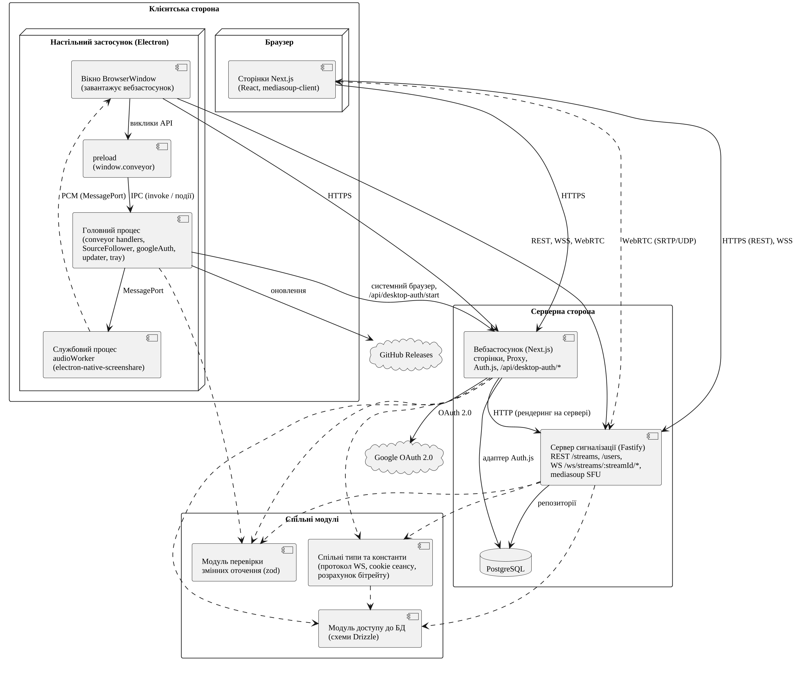{#fig:components width=16cm}

Вебзастосунок (Next.js) формує сторінки, виконує автентифікацію через Auth.js і під час серверного рендерингу отримує дані про трансляції від сервера сигналізації внутрішнім HTTP-запитом. Сервер сигналізації (Fastify) надає REST-інтерфейс і WebSocket-канали для сигнальних повідомлень, а також пересилає медіапотоки як SFU на основі mediasoup [@mediasoup-design]: потік стримера надходить на сервер один раз і розсилається кожному глядачеві без перекодування.

Настільний застосунок (Electron) не дублює інтерфейс: його вікно завантажує розгорнутий вебзастосунок, а головний процес [@electron-process-model] надає сторінці через об'єкт window.conveyor лише недоступне браузеру – перелік вікон з ідентифікаторами процесів, захоплення звуку застосунку в утилітарному процесі, слідування за вікнами та вхід через системний браузер.

Модуль доступу до бази даних містить схеми таблиць Drizzle ORM, спільні типи та константи – типи повідомлень протоколу, ім'я cookie сеансу та розрахунок бітрейту, модуль перевірки змінних оточення – перевірку конфігурації за схемами zod. Тому зміна протоколу чи схеми даних перевіряється компілятором в усіх модулях. Зовнішні системи – Google OAuth 2.0 для підтвердження особи та GitHub Releases для інсталяторів і автоматичного оновлення настільного застосунку.

Виробниче середовище описано засобами Docker Compose; його діаграму розгортання наведено на рис. @fig:deployment.

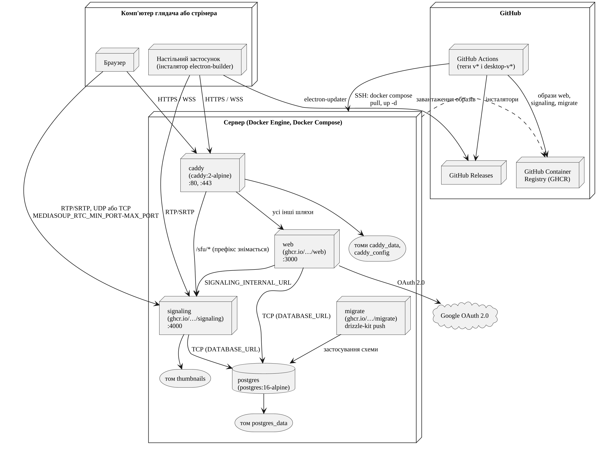{#fig:deployment width=16cm}

На сервері працюють п'ять сервісів. Сервіс caddy (порти 80, 443) автоматично отримує TLS-сертифікат і спрямовує запити з префіксом /sfu до сервера сигналізації, знімаючи префікс, а решту – до сервісу web, який запускає вебзастосунок Next.js з образу в GitHub Container Registry; змінні оточення AUTH_URL (публічна HTTPS-адреса сервера) і AUTH_TRUST_HOST налаштовують Auth.js на роботу за зворотним проксі. Сервіс signaling (порт 4000) додатково публікує діапазон портів UDP і TCP, заданий змінними оточення MEDIASOUP_RTC_MIN_PORT і MEDIASOUP_RTC_MAX_PORT, через який медіадані йдуть до клієнтів в обхід Caddy. Сервіс postgres на основі образу PostgreSQL 16 зберігає дані, а сервіс migrate одноразово застосовує схему бази даних засобами drizzle-kit. Мініатюри, дані СУБД і сертифікати зберігаються в томах; доставку змін на сервер автоматизовано засобами GitHub Actions.

## 3.2 Проєктування процесів у системі

Клієнти та сервер обмінюються JSON-повідомленнями трьох типів: запит методу з ідентифікатором, відповідь з тим самим ідентифікатором, що містить результат або помилку, та подія сервера. Методи й події протоколу сигналізації наведено в табл. @tbl:ws-protocol.

: Методи та події протоколу сигналізації {#tbl:ws-protocol}

| Метод / подія | Канал | Напрям | Параметри → результат |
|---|---|---|---|
| getRtpCapabilities | broadcast | клієнт → сервер | – → можливості RTP маршрутизатора |
| createTransport | обидва | клієнт → сервер | напрям (send / recv) → ідентифікатор, параметри ICE і DTLS, кандидати ICE |
| connectTransport | обидва | клієнт → сервер | параметри DTLS клієнта → – |
| produce | broadcast | клієнт → сервер | вид доріжки, параметри RTP, ознака last, максимальний бітрейт → ідентифікатор продюсера |
| endStream | broadcast | клієнт → сервер | – → – |
| joinStream | watch | клієнт → сервер | – → ідентифікатори продюсерів, можливості RTP |
| consume | watch | клієнт → сервер | можливості RTP клієнта, ідентифікатор продюсера → ідентифікатор споживача, вид доріжки, параметри RTP |
| streamEnd | watch | сервер → клієнт | трансляцію завершено |
| streamerDisconnect | watch | сервер → клієнт | з'єднання зі стримером втрачено |
| streamerReconnected | watch | сервер → клієнт | ідентифікатор нового продюсера |

Методи відповідають етапам встановлення WebRTC-сеансу [@rfc8825; @w3c-webrtc]: для кожного напряму створюється окремий транспорт, і після обміну параметрами DTLS медіадані йдуть протоколом SRTP [@rfc8827].

Публікацію трансляції наведено на діаграмі послідовності (рис. @fig:seq-broadcast). Вона деталізує кроки 8–9 сценарію @sc:browser-broadcast, які використовує й сценарій @sc:app-broadcast.

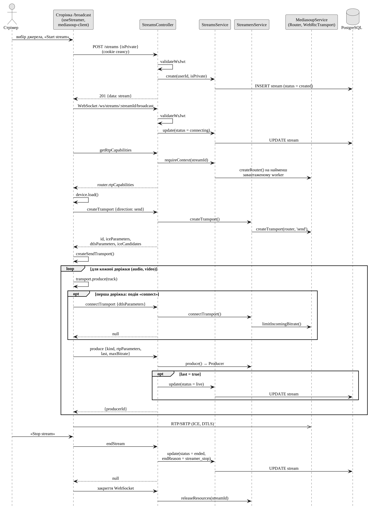{#fig:seq-broadcast width=16cm}

Сторінка трансляції створює запис трансляції REST-запитом і відкриває WebSocket-канал стримера. Обидва звернення проходять перевірку функцією validateWsJwt, яка розшифровує cookie сеансу Auth.js спільним секретом, тож сервер сигналізації перевіряє сеанс без звернення до вебзастосунку. Підключення переводить трансляцію в стан connecting. Запит getRtpCapabilities створює маршрутизатор mediasoup на найменш завантаженому процесі-обробнику (worker). Далі клієнт викликає produce для кожної доріжки, і ознака last останньої доріжки переводить трансляцію в стан live. Запит endStream фіксує завершення з причиною streamer_stop, а закриття сокета звільняє ресурси mediasoup.

Контекст активної трансляції (маршрутизатор, транспорти, продюсери й споживачі) зберігається лише в пам'яті сервера, а в базі даних – тільки статус і час трансляції.

Наступним розглянемо процес перегляду, що відповідає сценарію @sc:watch (рис. @fig:seq-watch).

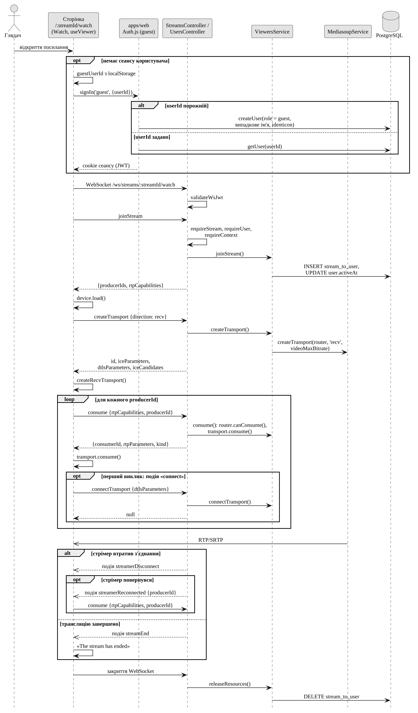{#fig:seq-watch width=13cm}

Сторінку перегляду виключено з переадресації на сторінку входу. Відвідувачу без сеансу вона виконує вхід через гостьовий провайдер (ФВ-03), який повторно використовує запис гостя, збережений у локальному сховищі браузера, або створює новий з роллю guest, випадковим іменем та аватаром. Запит joinStream додає глядача до таблиці stream_to_user і повертає ідентифікатори продюсерів; клієнт створює приймальний транспорт, початковий бітрейт якого сервер обчислює з максимального бітрейту відео трансляції, і виконує consume для кожного продюсера. Подію streamerReconnected клієнт обробляє споживанням нового продюсера, а streamEnd – заміною плеєра повідомленням про завершення; подію streamerDisconnect сервер надсилає, але клієнт її не обробляє. Закриття сокета видаляє запис глядача з таблиці stream_to_user.

Окремий процес становить вхід у настільному застосунку. Google блокує OAuth-вхід у вбудованих вебпереглядачах [@google-embedded-webviews], тому нативним застосункам рекомендовано використовувати системний браузер і локальну адресу зворотного виклику [@rfc8252]. Взаємодію, що реалізує ФВ-02, наведено на рис. @fig:seq-desktop-auth.

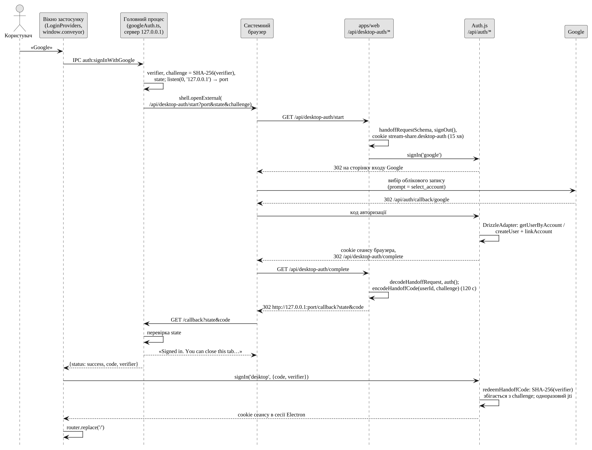{#fig:seq-desktop-auth width=15cm}

Головний процес за схемою PKCE [@rfc7636] генерує перевірочний рядок і його хеш SHA-256, запускає локальний HTTP-сервер і відкриває в системному браузері вхід вебзастосунку. Після входу через Google вебзастосунок видає пов'язаний із хешем одноразовий код (дійсний 120 с) і перенаправляє браузер на локальний сервер, а сторінка обмінює код і перевірочний рядок на сеанс. Перехоплений код без перевірочного рядка непридатний, а повторне використання коду блокується.

Вимога ФВ-09 передбачає перехід трансляції на нові вікна застосунку, зокрема відкриті його дочірніми процесами, і повернення до початкового вікна. Алгоритм класу SourceFollower, що реалізує цей режим, наведено на діаграмі діяльності (рис. @fig:act-follow).

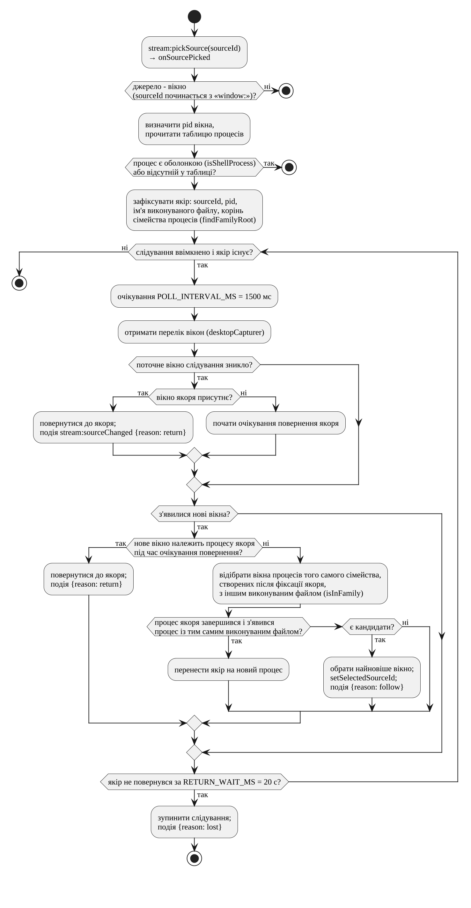{#fig:act-follow width=11.5cm}

Обране вікно стає «якорем» (вікна процесів-оболонок якорем не стають). Кожні 1500 мс клас порівнює перелік вікон від desktopCapturer [@electron-desktop-capturer] з попереднім і переходить на найновіше вікно процесу того самого сімейства з іншим виконуваним файлом; після його зникнення трансляція повертається до якоря, а якщо зникло й воно, слідування вимикається через 20 с. Сторінка замінює доріжку без перестворення трансляції.

Стани трансляції (поле status таблиці stream) і причини завершення (поле endReason) наведено на діаграмі станів (рис. @fig:state-stream).

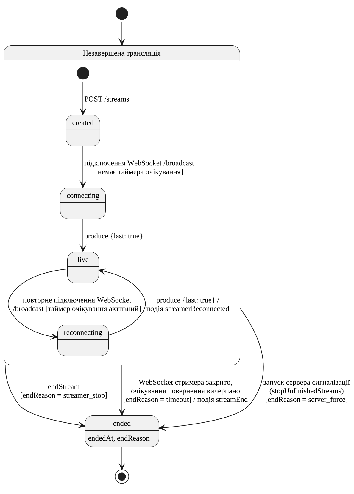{#fig:state-stream width=13cm}

Якщо сокет стримера закривається до запиту endStream, сервер надсилає глядачам подію streamerDisconnect і запускає таймер з інтервалом 6 с та обмеженням у п'ять спроб (ФВ-16), не змінюючи статусу в базі даних. Повторне підключення стримера за активного таймера дає стан reconnecting, а produce з ознакою last – знову live; інакше трансляція завершується з причиною timeout. Під час запуску сервер завершує незавершені трансляції з причиною server_force, оскільки їхній контекст у пам'яті втрачено.

## 3.3 Проєктування структури бази даних

Схему бази даних, визначену в модулі доступу до бази даних і застосовану до PostgreSQL засобами Drizzle, наведено на діаграмі «сутність – зв'язок» у нотації IE (рис. @fig:er).

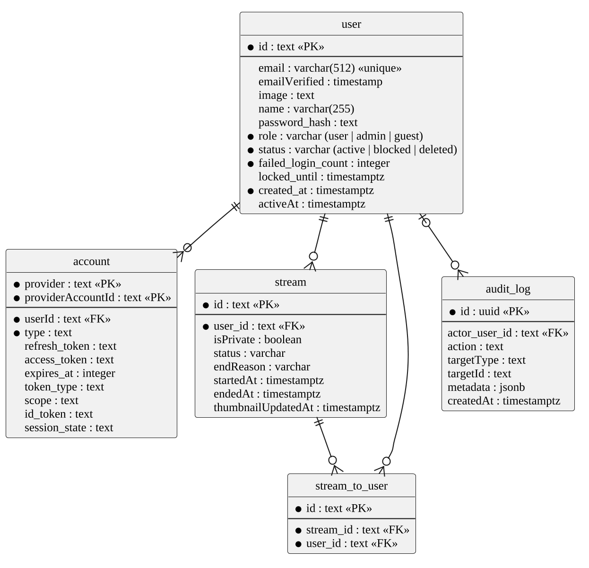{#fig:er width=13cm}

Схема містить п'ять таблиць, опис яких наведено в табл. @tbl:db-user–@tbl:db-audit-log. Порожніх значень не допускають поля з обмеженнями PK і NOT NULL, а також усі зовнішні ключі (FK), крім actor_user_id. Усі зовнішні ключі мають правило ON DELETE CASCADE, тож щотижневе очищення гостей (ФВ-19), яке видаляє гостей без активності понад 7 днів, що не дивляться жодної трансляції, автоматично видаляє й пов'язані записи. Сеанси зберігаються в зашифрованому JWT у cookie [@authjs-session-strategies], тому таблиць сеансів у схемі немає.

Таблиця user (табл. @tbl:db-user) є центральною: вона зберігає як користувачів, що увійшли через Google, так і гостей, яких розрізняє поле role. Поле role набуває значень user, admin і guest, поле status – active, blocked і deleted; новий запис типово отримує роль user і стан active, а поля created_at і activeAt – поточний час. Разом із таблицею account таблиця має структуру, якої очікує адаптер Auth.js: власний адаптер Drizzle створює користувача під час першого входу. Поля password_hash, failed_login_count і locked_until, стани blocked і deleted та роль admin закладено для входу за паролем і модерації; у поточній версії їх не заповнює жоден модуль.

: Опис таблиці user {#tbl:db-user}

| Поле | Тип даних | Обмеження | Опис |
|---|---|---|---|
| id | text | PK | Ідентифікатор (UUID) |
| email | varchar(512) | UNIQUE | Електронна пошта |
| emailVerified | timestamp | – | Підтвердження пошти |
| name | varchar(255) | – | Ім'я користувача |
| image | text | – | Адреса аватара |
| role | varchar | NOT NULL | Роль |
| status | varchar | NOT NULL | Стан запису |
| password_hash | text | – | Хеш пароля |
| failed_login_count | integer | NOT NULL | Невдалі спроби входу |
| locked_until | timestamptz | – | Кінець блокування |
| created_at | timestamptz | NOT NULL | Час створення запису |
| activeAt | timestamptz | – | Остання активність |

Таблиця account (табл. @tbl:db-account) пов'язує користувача з обліковим записом провайдера OAuth і зберігає токени, отримані під час входу через Google. Первинний ключ складено з полів provider і providerAccountId, тому той самий обліковий запис провайдера не може бути прив'язаний двічі.

: Опис таблиці account {#tbl:db-account}

| Поле | Тип даних | Обмеження | Опис |
|---|---|---|---|
| userId | text | FK (user) | Власник запису |
| type | text | NOT NULL | Тип за Auth.js |
| provider | text | PK | Провайдер |
| providerAccountId | text | PK | Код у провайдера |
| refresh_token | text | – | Токен оновлення |
| access_token | text | – | Токен доступу |
| expires_at | integer | – | Кінець дії токена |
| token_type | text | – | Тип токена |
| scope | text | – | Області доступу |
| id_token | text | – | ID-токен |
| session_state | text | – | Стан сеансу |

Таблиця stream (табл. @tbl:db-stream) зберігає трансляції; її ідентифікатор входить до посилання на перегляд. Значення полів status (типово created) і endReason відповідають діаграмі станів (рис. @fig:state-stream); причину admin_force оголошено, але не використовується. Приватні трансляції, позначені полем isPrivate, не потрапляють до загального переліку.

: Опис таблиці stream {#tbl:db-stream}

| Поле | Тип даних | Обмеження | Опис |
|---|---|---|---|
| id | text | PK | Ідентифікатор (UUID) |
| user_id | text | FK (user) | Стример |
| isPrivate | boolean | – | Ознака приватності |
| status | varchar | – | Стан трансляції |
| endReason | varchar | – | Причина завершення |
| startedAt | timestamptz | – | Час початку |
| endedAt | timestamptz | – | Час завершення |
| thumbnailUpdatedAt | timestamptz | – | Оновлення мініатюри |

Таблиця stream_to_user (табл. @tbl:db-stream-to-user) реалізує зв'язок «багато до багатьох» між трансляціями та їхніми поточними глядачами.

: Опис таблиці stream_to_user {#tbl:db-stream-to-user}

| Поле | Тип даних | Обмеження | Опис |
|---|---|---|---|
| id | text | PK | Ідентифікатор (UUID) |
| stream_id | text | FK (stream) | Трансляція |
| user_id | text | FK (user) | Глядач |

Таблиця audit_log (табл. @tbl:db-audit-log) призначена для журналу дій модерації; у поточній версії її не заповнює жоден модуль.

: Опис таблиці audit_log {#tbl:db-audit-log}

| Поле | Тип даних | Обмеження | Опис |
|---|---|---|---|
| id | uuid | PK | Ідентифікатор (UUID) |
| actor_user_id | text | FK (user) | Автор дії |
| action | text | – | Дія |
| targetType | text | – | Тип об'єкта дії |
| targetId | text | – | Ідентифікатор об'єкта |
| metadata | jsonb | – | Додаткові дані |
| createdAt | timestamptz | – | Час дії |

## 3.4 Проєктування класів

Код сервера сигналізації поділено на три шари: контролери, сервіси та репозиторії. Діаграму класів наведено на рис. @fig:classes-signaling.

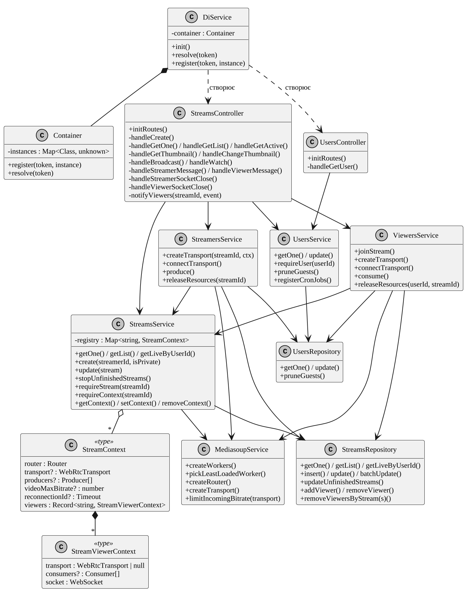{#fig:classes-signaling width=16cm}

Контролери реєструють маршрути Fastify: клас StreamsController – REST-маршрути трансляцій і обидва WebSocket-канали, клас UsersController – маршрут отримання користувача. Сервіси містять бізнес-логіку: StreamsService – трансляції та реєстр контекстів, StreamersService і ViewersService – транспорти, продюсери й споживачі стримера та глядачів, UsersService – користувачів і очищення гостей, MediasoupService – процеси-обробники, маршрутизатори та транспорти. Репозиторії інкапсулюють запити Drizzle. Залежності передаються через конструктори: замість DI-фреймворку клас Container зберігає словник «клас → екземпляр», а клас DiService, доступний як декоратор Fastify, під час запуску створює об'єкти в порядку залежностей. Граф об'єктів явний і статично типізований.

Сторінка настільного застосунку працює з увімкненою ізоляцією контексту і не має прямого доступу до API Node.js та Electron. Шар міжпроцесної взаємодії (у коді – conveyor) наведено на рис. @fig:classes-conveyor.

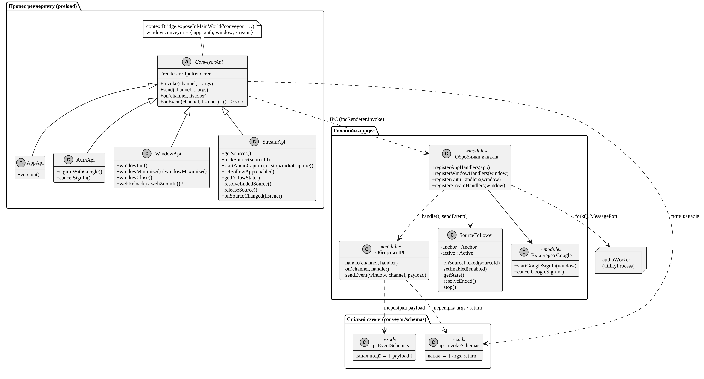{#fig:classes-conveyor width=16cm}

Абстрактний клас ConveyorApi обгортає модуль ipcRenderer; його нащадків AppApi, AuthApi, WindowApi і StreamApi сценарій preload публікує як об'єкт window.conveyor через contextBridge. У головному процесі обробники каналів реєструються спільною обгорткою, через яку надсилаються й події. Обидві сторони спираються на схеми zod ipcInvokeSchemas (аргументи й результат каналу) та ipcEventSchemas (дані подій): сторона рендерингу отримує з них типи, а головний процес перевіряє дані під час виконання. Захоплення звуку виконує утилітарний процес [@electron-process-model], який передає дані сторінці напряму через пару портів повідомлень.

## 3.5 Проєктування інтерфейсу користувача

Головна сторінка відвідувачу без входу показує опис сервісу та кнопку завантаження настільного застосунку, а користувачу – перелік активних публічних трансляцій. Кнопка «Start stream» у шапці (для гостей прихована) веде на сторінку трансляції, а сторінка перегляду відкривається з картки трансляції або за посиланням. Написи інтерфейсу англійські, тому на макетах їх наведено мовою оригіналу.

Макет сторінки трансляції, побудований засобами PlantUML Salt, наведено на рис. @fig:ui-broadcast.

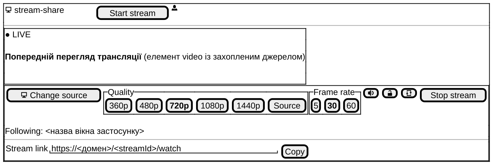{#fig:ui-broadcast width=16cm}

Під попереднім переглядом з індикатором стану розташовано панель керування: вибір джерела «Pick source» / «Change source», групи якості (360p–1440p, «Source») і частоти кадрів (5, 30, 60) (ФВ-10), перемикачі звуку (ФВ-13) і приватності (ФВ-11), кнопка початку чи зупинки трансляції та поле посилання з кнопкою копіювання (ФВ-12). У настільному застосунку вибір джерела відкриває модальне вікно з вкладками «Applications» і «Entire Screen» (ФВ-07), а панель містить перемикач слідування й напис «Following: …» (ФВ-09). За наявності незавершеної трансляції замість панелі показано кнопку «Reconnect».

Макет сторінки перегляду наведено на рис. @fig:ui-watch.

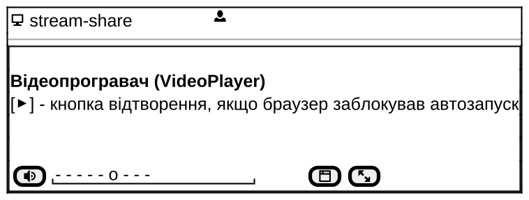{#fig:ui-watch width=12cm}

Сторінка містить відеопрогравач з керуванням звуком і гучністю, режимом «картинка в картинці» та повноекранним режимом, доступними й клавішами M, P, F (ФВ-14). Вибору якості на боці глядача немає. Після завершення трансляції програвач замінюється повідомленням «The stream has ended».

## Висновки до розділу 3

Спроєктована система складається з вебзастосунку, сервера сигналізації з SFU-пересиланням медіапотоків і настільного застосунку-оболонки, які спираються на спільні модулі схем даних, протоколу та конфігурації. Систему розгортають як набір контейнерів Docker Compose за зворотним проксі Caddy; медіатрафік WebRTC іде напряму до сервера сигналізації через виділений діапазон портів.

Діаграми процесів формалізують публікацію й перегляд трансляції, вхід у настільному застосунку, слідування за вікнами та відновлення після втрати з'єднання. Модель даних з п'яти таблиць узгоджено з Auth.js, класи сервера поділено на контролери, сервіси та репозиторії, а міжпроцесну взаємодію типізовано схемами zod. Ці рішення є основою програмної реалізації системи.
