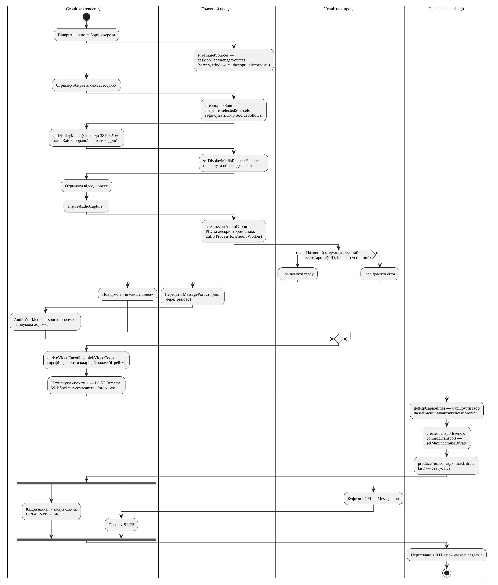

## 4.2 Реалізація захоплення окремих застосунків

Через ізоляцію контексту вебзастосунку в настільному застосунку доступний лише об'єкт window.conveyor сценарію preload [@electron-context-isolation]. Методи класу StreamApi відповідають каналам трансляції основного процесу (рис. @fig:classes-conveyor), для кожного з яких описано схеми zod аргументів і результату [@zod]. Спільні обгортки головного процесу перевіряють за ними аргументи, результати та події на межі процесів.

Перелік екранів і вікон із мініатюрами та піктограмами застосунків (ФВ-07) формує обробник каналу отримання джерел, а підміну системного вибору джерела – обробник запитів захоплення сеансу (лістинг @lst:get-sources).

```{#lst:get-sources .ts caption="Перелік джерел, визначення PID вікна та відповідь на запит захоплення"}
function pidForSource(sourceId: string): number {
  if (!sourceId.startsWith('window:')) return 0;
  const hwnd = Number(sourceId.split(':')[1]);
  return Number.isFinite(hwnd) ? getPidFromWindowHandle(hwnd) : 0;
}
// ...
  handle('stream:getSources', async () => {
    const [width, height] = mainWindow.getSize();
    const sources = await desktopCapturer.getSources({
      types: ['screen', 'window'],
      thumbnailSize: { width: width ?? 320, height: height ?? 180 },
      fetchWindowIcons: true,
    });
    // ...
  });
  // ...
  session.defaultSession.setDisplayMediaRequestHandler(async (request, callback) => {
    // ...
    const sources = await desktopCapturer.getSources({ types: ['window', 'screen'] });
    const chosen = sources.find((s) => s.id === selectedSourceId);
    // ...
    callback({ video: chosen ?? sources[0] });
  });
```

Джерела повертаються з мініатюрами у вигляді data URL [@electron-desktop-capturer]. Функція pidForSource виділяє з ідентифікатора джерела-вікна його дескриптор і визначає ідентифікатор процесу (PID) функцією getPidFromWindowHandle модуля electron-native-screenshare [@electron-native-screenshare], що приймає HWND у Windows, CGWindowID у macOS або ідентифікатор вікна X11; для екранів PID дорівнює 0. Обраний користувачем ідентифікатор джерела зберігається в основному процесі, а сторінка викликає стандартний метод getDisplayMedia [@w3c-screen-capture] з бажаною роздільністю 3840×2160. Системне вікно вибору не відкривається: обробник, установлений методом setDisplayMediaRequestHandler [@electron-session], відповідає збереженим джерелом, а за його відсутності – першим у списку.

Захоплення звуку окремого застосунку потребує окремого механізму. Обробник запитів захоплення Electron повертає як звук лише значення loopback – звук усієї системи і лише у Windows [@electron-session], тому вимогу ФВ-08 реалізовано модулем electron-native-screenshare в утилітному процесі, призначеному, зокрема, для компонентів, схильних до аварійного завершення [@electron-process-model; @electron-utility-process]. Обробник каналу запуску захоплення звуку створює цей процес і передає йому PID джерела та один кінець каналу повідомлень [@electron-message-ports] (лістинг @lst:audio-worker).

```{#lst:audio-worker .ts caption="Запуск захоплення звуку процесу в утилітному процесі"}
process.parentPort.once('message', (e) => {
  const { processId } = e.data as AudioWorkerInit;
  const port = e.ports[0];
  // ...
  try {
    const startCaptureCallback: AudioDataCallback = (audioData, meta) => {
      const ab = audioData.buffer.slice(
        audioData.byteOffset,
        audioData.byteOffset + audioData.byteLength,
      );
      port.postMessage({ ab, meta });
    };
    const args: [number, boolean, AudioDataCallback] = processId
      ? [processId, true, startCaptureCallback]
      : [process.pid, false, startCaptureCallback];

    port.start();
    const started = startCapture(...args);
    if (!started) throw new Error('startCapture() returned false');
    report({ type: 'ready' });
  } catch (err) {
    report({ type: 'error', error: err instanceof Error ? err.message : String(err) });
  }
});
```

Для відомого PID функція startCapture працює в режимі включення й захоплює звук лише цільового процесу, а для екрана – у режимі виключення самого утилітного процесу, тобто захоплює весь системний звук. Буфери PCM з метаданими формату йдуть портом, другий кінець якого основний процес передає сторінці лише після повідомлення про готовність. На сторінці міст звуку створює вузол AudioWorklet, процесор якого виконується в окремому потоці Web Audio [@mdn-audioworklet]: він перетворює відліки на дійсні, лінійно передискретизує їх до частоти контексту, тримає в буфері не більше 1 с звуку, а за нестачі даних видає тишу. Отримана звукова доріжка додається до захопленого відеопотоку; якщо будь-який крок не вдається, трансляція продовжується лише з відео з повідомленням користувачу (ФВ-08). [ПОТРЕБУЄ УТОЧНЕННЯ: операційні системи, на яких фактично перевірено захоплення звуку окремого застосунку.]

Режим слідування за вікнами застосунку (ФВ-09) реалізує клас SourceFollower за алгоритмом рис. @fig:act-follow. Після вибору вікна клас фіксує якір: PID, виконуваний файл, корінь сімейства процесів і час вибору. Таблицю процесів отримують засобами PowerShell у Windows або утилітою ps в інших ОС. Коренем сімейства є найвищий предок, що не належить до оболонки (Провідник Windows, launchd, systemd тощо), а батько, створений більш ніж на 2 с пізніше за нащадка, не враховується, що захищає від повторного використання PID. Кожні 1500 мс клас перевіряє нові вікна (лістинг @lst:follower).

```{#lst:follower .ts caption="Вибір вікна для слідування в класі SourceFollower"}
    const candidates: (PidWindow & { createdAt: Date })[] = [];
    for (const w of others) {
      const info = table.get(w.pid);
      if (!info) continue;
      if (!isInFamily(table, w.pid, anchor.familyRoot)) continue;
      if (info.createdAt <= anchor.startedAt) continue;

      const sameExe = info.name.toLowerCase() === anchor.exe.toLowerCase();
      if (sameExe && !anchorAlive) {
        // The anchor process was replaced (League's "close client during game").
        this.anchor = { ...anchor, sourceId: w.id, pid: w.pid };
        // ...
        return;
      }
      if (sameExe) continue;
      candidates.push({ ...w, createdAt: info.createdAt });
    }
    if (candidates.length === 0) return;

    candidates.sort((a, b) => b.createdAt.getTime() - a.createdAt.getTime());
    const winner = candidates[0]!;
    // ...
    this.deps.setSelectedSourceId(winner.id);
    // ...
    this.deps.emit({ reason: 'follow', sourceId: winner.id, name: winner.name });
```

Обирається найновіше вікно процесу того самого сімейства, запущеного після вибору якоря, з іншим виконуваним файлом; процес з тим самим файлом за завершеного якоря означає перезапуск застосунку, і якір переноситься на нього. Після закриття вікна, за яким слідували, клас повертається до якоря, а якщо той не з'являється за 20 с, надсилає подію lost, і трансляція зупиняється. На події follow і return сторінка послідовно зупиняє доріжки й утилітний процес, знову викликає метод getDisplayMedia, запускає захоплення звуку нового PID і замінює доріжки методом replaceTrack, що не потребує узгодження із сервером [@mediasoup-client-api], тому глядачі не перепідключаються.

Взаємодію описаних механізмів захоплення з публікацією на сервері показано на рис. @fig:capture-pipeline.

{#fig:capture-pipeline width=16cm}

Відео й звук ідуть паралельними шляхами: кадри вікна кодує стек WebRTC Chromium, а відліки PCM надходять на сторінку через порт повідомлень і кодуються в Opus; розгалуження відповідає режиму «лише відео».

## 4.3 Реалізація потокової передачі на основі WebRTC та SFU

Сервер сигналізації запускає задану змінною оточення MEDIASOUP_NUM_WORKERS кількість процесів worker mediasoup (типово – за кількістю ядер процесора) – підпроцесів C++, що обробляють ICE, DTLS і RTP [@mediasoup-design], з портами RTC 40000–49999. Кожна трансляція отримує власний маршрутизатор на найменш завантаженому worker; його обирає метод pickLeastLoadedWorker (лістинг @lst:worker-pick).

```{#lst:worker-pick .ts caption="Вибір найменш завантаженого процесу worker"}
  async pickLeastLoadedWorker(): Promise<Worker> {
    if (!this.workers.length) {
      throw new Error('Workers is empty');
    }

    const usages = await Promise.all(
      this.workers.map(async (w) => ({
        entry: w,
        usage: await w.getResourceUsage(),
      })),
    );
    usages.sort((a, b) => a.usage.ru_utime - b.usage.ru_utime);

    return usages[0]!.entry;
  }
```

Мірою навантаження є час виконання в режимі користувача (поле ru_utime статистики ресурсів процесу) [@mediasoup-api]; він накопичується від запуску процесу, тож вибір враховує сумарне, а не поточне навантаження.

Маршрутизатор кожної трансляції оголошує Opus з частотою 48 кГц і двома каналами, H.264 у двох профілях і VP8 (лістинг @lst:codecs).

```{#lst:codecs .ts caption="Кодеки відео маршрутизатора mediasoup"}
    const router = await worker.createRouter({
      mediaCodecs: [
        // ...
        {
          kind: 'video',
          mimeType: 'video/H264',
          clockRate: 90000,
          parameters: {
            'packetization-mode': 1,
            'profile-level-id': '42001f',
            'level-asymmetry-allowed': 1,
            'x-google-start-bitrate': START_BITRATE_KBPS,
          },
        },
        // ...
        /** Software fallback for endpoints without H.264. */
        {
          kind: 'video',
          mimeType: 'video/VP8',
          // ...
```

Браузери зобов'язані підтримувати VP8 і H.264 Constrained Baseline [@rfc7742], тому кожному клієнту доступний хоча б один кодек. За коментарем у коді H.264 стоїть першим, бо лише його кодують апаратно всі цільові клієнти, що робить стійкими режими 1080p60, 1440p60 і 4K, а Baseline (профіль 42001f) передує Constrained Baseline (42e01f), бо останній у Chromium надає лише програмний OpenH264. Коментар посилається на перевірку розробником у Chrome 152 з NVENC; власних вимірювань у роботі не виконувалося. Параметр packetization-mode зі значенням 1 задає неперемежований режим пакетизації [@rfc6184], параметр level-asymmetry-allowed дозволяє рівні, вищі за оголошений (1440p60 потребує рівня 5.1). Клієнт обирає кодек у тому самому порядку.

Параметри кодування відео обчислює функція deriveVideoEncoding (лістинг @lst:encoding) за розмірами доріжки та обраними профілем і частотою кадрів (ФВ-10; типово 720p і 30 кадр/с).

```{#lst:encoding .ts caption="Обчислення параметрів кодування відео"}
export function deriveVideoEncoding(
  track: { width: number; height: number },
  settings: VideoSettings,
): DerivedVideoEncoding {
  const { quality } = settings;
  const fps = clampVideoSettings(settings, track.height).fps;
  const scaleResolutionDownBy = getScaleResolutionDownBy(track.height, quality);
  const targetWidth = track.width / scaleResolutionDownBy;
  const targetHeight = track.height / scaleResolutionDownBy;
  const maxBitrate = videoBitrateBudget(targetWidth * targetHeight, fps);
  const isHighFps = fps > HIGH_FPS_THRESHOLD;

  return {
    encoding: { scaleResolutionDownBy, maxFramerate: fps, maxBitrate },
    degradationPreference: isHighFps ? 'maintain-framerate' : 'maintain-resolution',
    contentHint: isHighFps ? 'motion' : 'detail',
    frameRate: { ideal: fps, max: fps },
    startBitrateKbps: Math.round(startBitrateFor(maxBitrate) / 1000),
  };
}
```

Коефіцієнт зменшення роздільності (поле scaleResolutionDownBy) – відношення висоти доріжки до висоти профілю, не менше 1, тож зображення не збільшується; за вихідної висоти понад 1440 пікселів частоту обмежено 30 кадр/с. Бюджет бітрейту обчислює спільна функція videoBitrateBudget за формулою @eq:bitrate.

::: {#eq:bitrate}
$$B = \min\left(\max\left(N \cdot 30 \cdot 0{,}07 \cdot \left(\frac{f}{30}\right)^{\log_2 1{,}5};\ 3 \cdot 10^{5}\right);\ 1{,}8 \cdot 10^{7}\right),$$
:::

де $B$ – бюджет бітрейту, біт/с; $N$ – кількість пікселів вихідного кадру; $f$ – частота кадрів, кадр/с. Показник $\log_2 1{,}5$ відображає закладене в коді припущення, що подвоєння частоти кадрів потребує в 1,5 раза більшого бітрейту. Початковий бітрейт кодувальника [@mediasoup-client-api] становить половину бюджету. За 60 кадр/с обираються пріоритет деградації maintain-framerate і підказка вмісту motion, інакше – maintain-resolution і detail, тобто за нестачі пропускної здатності зберігається відповідно плавність або чіткість [@w3c-mst-content-hint]. Обчислені значення для джерела 3840×2160 наведено в табл. @tbl:encoding.

: Параметри кодування відео для джерела 3840×2160, обчислені за кодом {#tbl:encoding}

| Профіль | Вихідна роздільність | Коефіцієнт зменшення | Максимальний бітрейт, Мбіт/с (5 / 30 / 60 кадр/с) | Початковий бітрейт, Мбіт/с (30 / 60 кадр/с) |
|---|---|---|---|---|
| 360p | 640×360 | 6 | 0,30 / 0,48 / 0,73 | 0,24 / 0,36 |
| 480p | 853×480 | 4,5 | 0,30 / 0,86 / 1,29 | 0,43 / 0,65 |
| 720p | 1280×720 | 3 | 0,68 / 1,94 / 2,90 | 0,97 / 1,45 |
| 1080p | 1920×1080 | 2 | 1,53 / 4,35 / 6,53 | 2,18 / 3,27 |
| 1440p | 2560×1440 | 1,5 | 2,71 / 7,74 / 11,61 | 3,87 / 5,81 |
| Source | 3840×2160 | 1 | 6,11 / 17,42 / – | 8,71 / – |

Значення є розрахунковими верхніми межами; фактичний бітрейт визначає оцінювання пропускної здатності WebRTC. Зміна профілю чи частоти під час трансляції не потребує повторного узгодження: метод applyConstraints змінює частоту захоплення, а метод setParameters відправника RTP – параметри кодування [@w3c-webrtc].

На боці сервера бітрейт обмежується з обох напрямів. Після з'єднання транспорту стрімера сервер обмежує вхідний бітрейт транспорту [@mediasoup-api] типовим значенням 21,6 Мбіт/с – максимальний бюджет 18 Мбіт/с із запасом 1,2 на Opus, повторні передачі й заголовки; менше значення спричиняє попередження під час запуску. Транспорти глядачів створюються з початковою доступною вихідною швидкістю, що дорівнює половині бюджету відео, але не менше 4 Мбіт/с, тому для трансляції 4K оцінювання починається з 8,71 Мбіт/с замість типових для mediasoup 600 кбіт/с [@mediasoup-api].

Методи та події сигналізації (табл. @tbl:ws-protocol) передаються через WebSocket [@rfc6455] як JSON-конверти запиту, відповіді з ознакою успіху і події. Їхні типи виводяться зі спільного для клієнта й сервера опису протоколу, проте на відміну від IPC під час виконання схемами не перевіряються. Клієнтську частину реалізує клас WsClient (лістинг @lst:ws-message).

```{#lst:ws-message .ts caption="Типізований запит клієнта сигналізації"}
  async request<M extends WsResponse['method']>(
    msg: Extract<WsRequest, { method: M }>,
  ): Promise<Extract<WsResponse, { method: M }>> {
    if (this.openPromise) await this.openPromise;
    const requestId = this.nextId++;
    return new Promise((resolve, reject) => {
      this.pending.set(requestId, {
        resolve: resolve as (msg: WsResponse) => void,
        reject,
      });
      this.ws.send(constructRequest({ ...msg, requestId }));
    }) as Promise<Extract<WsResponse, { method: M }>>;
  }
```

Відповідь знаходить свою обіцянку за ідентифікатором запиту, а закриття з'єднання відхиляє всі очікувані запити. Послідовність публікації (рис. @fig:seq-broadcast) хук useStreamer реалізує засобами mediasoup-client [@mediasoup-client-api], передаючи в запиті produce бюджет бітрейту.

На боці глядача хук useViewer реалізує послідовність рис. @fig:seq-watch: після запиту joinStream створюються приймальний транспорт і споживач для кожного продюсера, причому сервер перевіряє, чи може маршрутизатор передати потік із можливостями клієнта [@mediasoup-api]. Доріжки об'єднуються в один медіапотік відеоелемента; якщо автовідтворення заблоковано, показується кнопка запуску. Подія streamerReconnected (рис. @fig:state-stream) замінює споживачів без перезавантаження сторінки. Мініатюру трансляції сторінка стрімера знімає одразу і далі кожні 5 хв як JPEG з якістю 0,7.

Обмеженням реалізації є єдине кодування без simulcast і SVC: simulcast у mediasoup-client потребує кількох записів кодування [@mediasoup-client-api], тому всі глядачі отримують однакову якість. Метод setPreferredLayer, оголошений у спільному протоколі, не має обробника ні на сервері, ні в клієнті.
