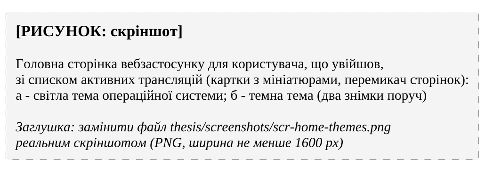

## 4.4 Реалізація автентифікації та авторизації

Автентифікацію у вебзастосунку реалізовано трьома провайдерами Auth.js. Провайдер Google (ФВ-01) передає параметр prompt зі значенням select_account, тож вибір облікового запису пропонується під час кожного входу [@authjs-google]. Два провайдери типу Credentials, у яких рішення ухвалює власна функція authorize [@authjs-credentials], обслуговують гостьовий сеанс (провайдер guest, ФВ-03) і завершення входу з настільного застосунку (провайдер desktop, ФВ-02). Параметри сеансу наведено в лістингу @lst:authjs.

```{#lst:authjs .ts caption="Стратегія сеансу та параметри файлу cookie в конфігурації Auth.js"}
const config: NextAuthConfig = {
  adapter,
  session: {
    strategy: 'jwt',
  },
  useSecureCookies: useSecureAuthCookies,
  cookies: {
    sessionToken: {
      name: SESSION_COOKIE_NAME,
      options: {
        httpOnly: true,

        sameSite: 'lax',
        path: '/',
        secure: useSecureAuthCookies,
      },
    },
  },
  providers: [
    // ...
  ],
```

Сеанс зберігається в зашифрованому токені у файлі cookie [@authjs-session-strategies]. Атрибут HttpOnly закриває cookie від сценаріїв сторінки, SameSite=Lax обмежує його надсилання з інших сайтів, а Secure дозволяє передавання лише через HTTPS [@mdn-set-cookie]. Ознака useSecureAuthCookies зі спільних констант істинна лише у виробничому середовищі, і тоді ім'я cookie отримує префікс \_\_Secure-, з яким браузер приймає його тільки від захищеної сторінки [@mdn-set-cookie]. Гостьовий провайдер створює запис із роллю guest і випадковим іменем, ідентифікатор якого сторінка перегляду зберігає в локальному сховищі браузера для повторного використання.

Обмеження доступу до сторінок (ФВ-04) виконує проміжний обробник Next.js (Proxy) [@nextjs-proxy]. Він не вважає гостьовий сеанс входом і перенаправляє такого відвідувача на сторінку входу з усіх сторінок, крім головної, сторінки входу та сторінки повернення до настільного застосунку. Шаблон шляхів обробника виключає з перевірки API-маршрути, статичні файли й сторінки перегляду трансляцій, тому перегляд доступний без облікового запису Google.

Сервер сигналізації самостійно розшифровує той самий cookie (лістинг @lst:jwt-verify). Ключ розшифрування бібліотека Auth.js виводить із секрету та «солі» – імені cookie, тому сервер бере це ім'я зі спільних констант, а значення змінної оточення AUTH_SECRET обох сервісів збігаються.

```{#lst:jwt-verify .ts caption="Перевірка сеансового cookie на сервері сигналізації"}
export const NEXT_AUTH_SALT = SESSION_COOKIE_NAME;

export async function decodeAuthToken(rawToken: string): Promise<JWT | null> {
  const payload = await decode({
    salt: NEXT_AUTH_SALT,
    secret: env.AUTH_SECRET,
    token: rawToken,
  });
  if (!payload?.sub) return null;
  return payload;
}
// ...
export const validateWsJwt = async (
  req: FastifyRequest, reply: FastifyReply): Promise<void> => {
  const rawToken = req.cookies[NEXT_AUTH_SALT];
  // ...
  const payload = await decodeAuthToken(rawToken);

  if (!payload) {
    reply.code(401).send({ error: 'Invalid token' });
    return;
  }

  req.context.userId = payload.sub;
};
```

Функція validateWsJwt підключена як хук попередньої перевірки до групи REST-маршрутів трансляцій і обох маршрутів WebSocket; відповідь 401 з хука зупиняє обробку запиту [@fastify-hooks]. Належність трансляції перевіряє лише маршрут завантаження мініатюри (відповідь 403), а сокет публікації покладається на непередбачуваність UUID трансляції. Приватну трансляцію (ФВ-11) маршрут пошуку виключає з переліку примусовим фільтром за полем isPrivate, а переглянути її може кожен, хто має посилання.

Вхід у настільному застосунку спирається на послідовність, наведену на рис. @fig:seq-desktop-auth, а її початок у головному процесі Electron – у лістингу @lst:pkce.

```{#lst:pkce .ts caption="Параметри PKCE і запуск входу в системному браузері"}
  const verifier = base64url(randomBytes(32));
  const challenge = createHash('sha256').update(verifier).digest('base64url');
  const state = base64url(randomBytes(16));
  // ...
        const port = await listen(server);
        // ...
        const url = new URL('/api/desktop-auth/start', __WEB_URL__);
        url.searchParams.set('port', String(port));
        url.searchParams.set('state', state);
        url.searchParams.set('challenge', challenge);

        await shell.openExternal(url.toString());
```

Локальний сервер слухає адресу 127.0.0.1 на порту, призначеному операційною системою [@rfc8252], і відхиляє запити з чужим параметром state. Вебзастосунок будує адресу повернення за фіксованим шаблоном локальної адреси, що виключає відкрите перенаправлення, а запит і одноразовий код шифруються з різними «солями», тож один тип токена не можна підставити замість іншого. Провайдер desktop порівнює SHA-256 від перевірочного рядка (verifier) з викликом (challenge) коду функцією сталого часу timingSafeEqual [@rfc7636] і відхиляє повторно використаний ідентифікатор коду. Реєстр використаних ідентифікаторів зберігається в пам'яті процесу, тому за кількох екземплярів вебзастосунку одноразовість не гарантована.

Вхід за паролем, обмеження спроб входу та журнал аудиту не реалізовано: стовпці password_hash, failed_login_count, locked_until і таблиця audit_log лише зарезервовані у схемі.

## 4.5 Реалізація рівня даних і програмного інтерфейсу сервера

Таблиці бази даних (рис. @fig:er) описано в модулі доступу до бази даних засобами Drizzle ORM разом зі зв'язками трансляції зі стримером і глядачами. Типи рядків виводяться зі схем, тому вебзастосунок і сервер сигналізації використовують одні типи без генерації коду [@drizzle-overview]. Окремих міграцій немає: контейнер migrate виконує команду push утиліти drizzle-kit у примусовому режимі, яка застосовує відмінності схеми безпосередньо до бази даних [@drizzle-kit-push].

Репозиторії сервера сигналізації інкапсулюють запити Drizzle, а контролери перетворюють помилки на коди 404, 400 чи 500 (рис. @fig:classes-signaling). Маршрути наведено в табл. @tbl:api; ззовні вони доступні через Caddy з префіксом /sfu.

: Маршрути програмного інтерфейсу сервера сигналізації {#tbl:api}

| Метод і шлях | Сеанс | Призначення |
|---|---|---|
| POST /streams | так | створення трансляції (ознака приватності) |
| POST /streams/search | так | сторінка публічних трансляцій з фільтрами й сортуванням |
| GET /streams/:userId/active | так | активна трансляція користувача |
| GET, POST /streams/:streamId/thumbnail | так (POST – власник) | отримання та збереження мініатюри |
| GET /streams/:streamId | ні | трансляція зі стримером і глядачами |
| GET /users/:userId | ні | відомості про користувача |
| GET /ws/streams/:streamId/broadcast | так | WebSocket стримера |
| GET /ws/streams/:streamId/watch | так, зокрема гостьовий | WebSocket глядача |

Метод registerCronJobs класу UsersService реєструє в плагіні планувальника Fastify щотижневе завдання (понеділок, 00:00), яке видаляє гостей без активності понад 7 діб, що не дивляться жодної трансляції (ФВ-19).

Модуль перевірки змінних оточення перевіряє їх під час запуску схемою zod і в разі помилок зупиняє запуск із переліком усіх некоректних змінних; зокрема, змінна оточення AUTH_SECRET має містити не менше 32 символів, а у виробничому середовищі змінна оточення AUTH_URL має бути адресою HTTPS.

## 4.6 Реалізація інтерфейсу користувача та розгортання

Основні сторінки вебзастосунку мають спільні шапку й підвал, а серверні компоненти отримують дані з сервера сигналізації через внутрішню мережу Docker (підрозділ 3.1). Головна сторінка відвідувачу показує кнопку завантаження настільного застосунку для операційної системи із заголовка User-Agent (ФВ-18), а користувачу – по 12 карток активних трансляцій на сторінці (ФВ-05).

Кольори світлої й темної тем задано змінними CSS, які директива theme перетворює на змінні теми Tailwind CSS [@tailwind-theme]. Компонент ThemeProvider бібліотеки next-themes перемикає тему класом кореневого елемента й типово обирає її за налаштуванням операційної системи [@next-themes]; окремого перемикача теми немає. Головну сторінку в обох темах наведено на рис. @fig:scr-home-themes.

[ПОТРЕБУЄ УТОЧНЕННЯ: РИСУНОК: скріншот головної сторінки зі списком активних трансляцій у світлій і темній темах – замінити заглушку рисунка]

{#fig:scr-home-themes width=16cm}

Теми різняться лише значеннями змінних кольорів, тому компонент, що використовує кольори теми, підтримує обидві без додаткового коду.

Збирання та розгортання автоматизовано засобами GitHub Actions. За тегом версії сервісу робочий процес збирає образи web, signaling і migrate у GitHub Container Registry та оновлює їх на сервері через SSH засобами Docker Compose згідно з діаграмою розгортання (рис. @fig:deployment), а за тегом версії настільного застосунку – інсталятори NSIS, DMG і AppImage засобами electron-builder [@electron-builder] для випуску GitHub. Автоматичне оновлення [@electron-builder-autoupdate] працює лише у Windows і Linux (підрозділ 1.4).

## Висновки до розділу 4

Систему реалізовано мовою TypeScript зі спільними модулями. Захоплення окремого застосунку з його звуком і слідування за його вікнами виконує настільний застосунок Electron, а потокову передачу – SFU mediasoup з H.264 як основним кодеком.

Автентифікація поєднує вхід через Google, гостьові сеанси та вхід настільного застосунку через системний браузер за схемою PKCE, а зашифрований сеанс JWT у cookie перевіряє й сервер сигналізації. Обмеженнями є відсутність перевірки власника для сокета публікації та неможливість відкликати сеанс до завершення строку дії.
