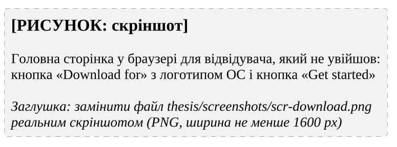
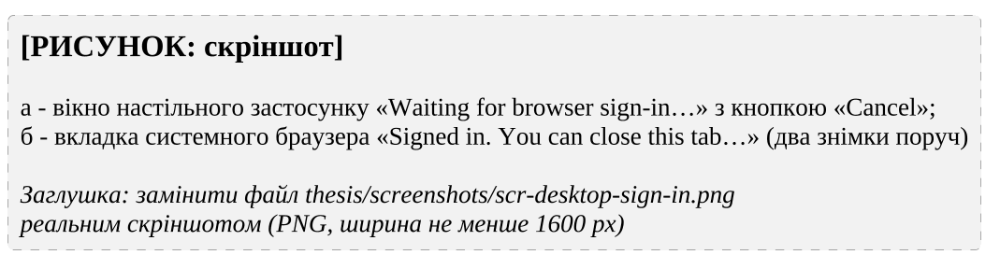
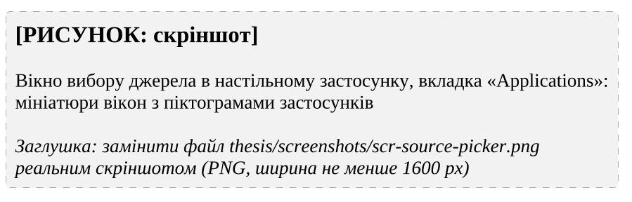
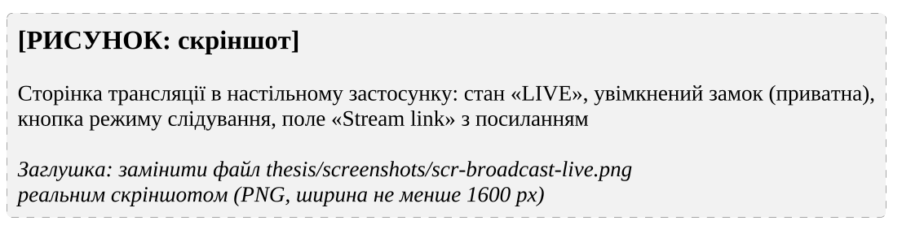
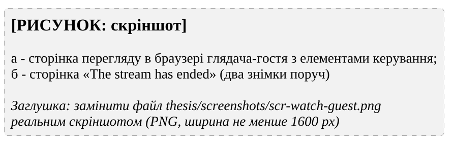
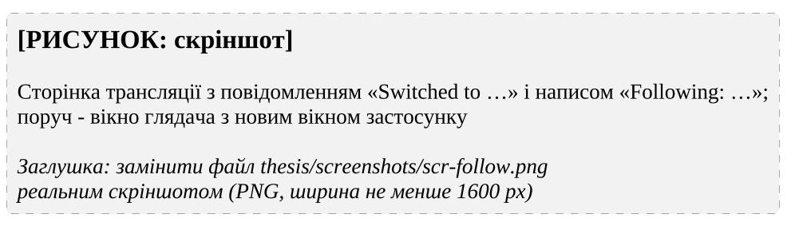

# 6 ЕКСПЛУАТАЦІЯ ПРОГРАМНОЇ СИСТЕМИ

## 6.1 Контрольний приклад застосування програмної системи

Контрольний приклад відтворює сценарії @sc:app-broadcast, @sc:watch та @sc:end-reconnect на розгорнутому сервісі за участю стримера у Windows і незареєстрованого глядача на іншому пристрої [ПОТРЕБУЄ УТОЧНЕННЯ: адреса сервісу, версії ОС, браузера і застосунку].

Відвідувач, який не увійшов, бачить на головній сторінці кнопку «Download for» з логотипом своєї ОС, що завантажує інсталятор останнього випуску GitHub (рис. @fig:scr-download).

[ПОТРЕБУЄ УТОЧНЕННЯ: скріншот screenshots/scr-download.png]

{#fig:scr-download width=16cm}

Інсталятор NSIS встановлює застосунок для поточного користувача з вибором каталогу. Вікно застосунку відкриває той самий вебінтерфейс без кнопки завантаження, а меню в системному лотку містить пункти «Open», «Check for updates…» і «Quit».

У настільному застосунку кнопка «Log in» відкриває сторінку входу, а «Continue with Google» – вхід у системному браузері; застосунок показує стан очікування з кнопкою «Cancel» (рис. @fig:scr-desktop-sign-in).

[ПОТРЕБУЄ УТОЧНЕННЯ: скріншот screenshots/scr-desktop-sign-in.png]

{#fig:scr-desktop-sign-in width=16cm}

Після вибору облікового запису вкладка браузера пропонує повернутися до застосунку, а він обмінює одноразовий код на сеанс і відкриває перелік трансляцій.

Кнопка «Start stream» у шапці відкриває сторінку трансляції, а «Pick source» – вікно вибору джерела з вкладками «Applications» і «Entire Screen» (рис. @fig:scr-source-picker).

[ПОТРЕБУЄ УТОЧНЕННЯ: скріншот screenshots/scr-source-picker.png]

{#fig:scr-source-picker width=16cm}

Вікна показано мініатюрами з піктограмами застосунків. Після вибору вікна починається попередній перегляд зі станом «PREVIEW» і захоплення звуку лише цього застосунку; якщо звук недоступний, з'являється повідомлення про передавання тільки відео. Режим слідування увімкнено за замовчуванням.

Для запуску приватної трансляції стример обирає якість і частоту кадрів (типово 720p і 30 кадр/с), вмикає приватність кнопкою із замком і натискає «Start stream». Стан змінюється на «LIVE», а поле «Stream link» показує посилання на сторінку перегляду трансляції з кнопкою «Copy» (рис. @fig:scr-broadcast-live).

[ПОТРЕБУЄ УТОЧНЕННЯ: скріншот screenshots/scr-broadcast-live.png]

{#fig:scr-broadcast-live width=16cm}

Приватна трансляція не потрапляє до переліку на головній сторінці, а змінити приватність після запуску не можна.

Глядач відкриває посилання без входу, система створює гостьовий сеанс із випадковим іменем і відтворює трансляцію (рис. @fig:scr-watch-guest, а).

[ПОТРЕБУЄ УТОЧНЕННЯ: скріншот screenshots/scr-watch-guest.png]

{#fig:scr-watch-guest width=16cm}

Глядач керує гучністю, режимом «картинка в картинці» і повноекранним режимом кнопками або клавішами M, P і F.

Коли застосунок, що транслюється, відкриває нове вікно (наприклад, програма запуску – вікно гри), джерело перемикається без дій стримера з повідомленням «Switched to …» і написом «Following: …» (рис. @fig:scr-follow).

[ПОТРЕБУЄ УТОЧНЕННЯ: скріншот screenshots/scr-follow.png]

{#fig:scr-follow width=16cm}

Глядач бачить нове вікно без перепідключення. Після його закриття трансляція повертається до початкового вікна («Back to …»), а якщо зникло й воно, завершується з повідомленням «The captured app closed».

Кнопка «Stop stream» завершує трансляцію, а глядач бачить сторінку «The stream has ended» з кнопкою повернення до переліку (рис. @fig:scr-watch-guest, б).

## 6.2 Експлуатаційні випробування програмної системи

Критерієм досягнення мети є автоматичне, без дій стримера, перемикання трансляції на нове вікно застосунку протягом 1,5 с. Його підтверджують тестові приклади Д3, у якому трансляція перемкнулася на нове вікно через 1,5 с, і Д5, у якому повернення до вихідного вікна відбулося через 1,3 с (табл. @tbl:tc-functional), а також ручна перевірка слідування в реальному застосунку після її виконання.

Затримку доставки зображення глядачеві оцінюють як експлуатаційну характеристику, а не як критерій досягнення мети. Для цього у вікні застосунку працює екранний секундомір, а різницю його показів у вікнах стримера й глядача фіксують на одному знімку 10 разів для кожних умов. Результати випробувань наведено в табл. @tbl:trials.

: Результати експлуатаційних випробувань {#tbl:trials}

| № | Умови | Затримка, мс (сер. / макс.) | Відповідність меті |
|---|---|---|---|
| 1 | [ПОТРЕБУЄ УТОЧНЕННЯ: мережа, якість, кількість глядачів] | [ПОТРЕБУЄ УТОЧНЕННЯ: значення] | [ПОТРЕБУЄ УТОЧНЕННЯ: так / ні] |
| 2 | [ПОТРЕБУЄ УТОЧНЕННЯ: мережа, якість, кількість глядачів] | [ПОТРЕБУЄ УТОЧНЕННЯ: значення] | [ПОТРЕБУЄ УТОЧНЕННЯ: так / ні] |
| 3 | [ПОТРЕБУЄ УТОЧНЕННЯ: мережа, якість, кількість глядачів] | [ПОТРЕБУЄ УТОЧНЕННЯ: значення] | [ПОТРЕБУЄ УТОЧНЕННЯ: так / ні] |

[ПОТРЕБУЄ УТОЧНЕННЯ: висновок за табл. 6.1; факти використання сервісу, лише якщо вони є]

## Висновки до розділу 6

Контрольний приклад охоплює повний шлях користувача від встановлення настільного застосунку і входу через системний браузер до приватної трансляції вікна застосунку, перегляду гостем, автоматичного перемикання на нове вікно та завершення трансляції. Усі кроки виконуються засобами інтерфейсу.

Мети досягнуто: трансляція без дій стримера перемикається на нове вікно застосунку за 1,5 с і повертається до вихідного вікна за 1,3 с, а затримку доставки визначено як експлуатаційну характеристику з окремою методикою вимірювання.
